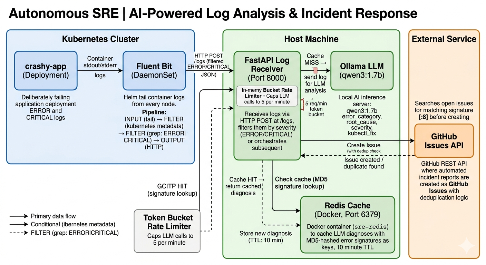
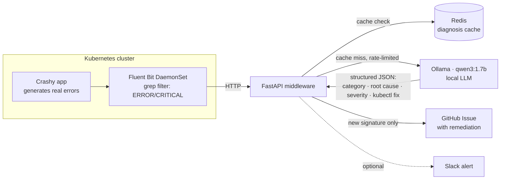

# AI-Powered Log Analysis & Incident Response

> An autonomous SRE pipeline: Kubernetes errors are collected by Fluent Bit, diagnosed by a **local LLM**, deduplicated through Redis, and turned into **GitHub Issues with root cause and a proposed `kubectl` fix** — plus optional Slack alerts — with no human in the loop.

## 🎯 The Problem

During an incident, the slowest step is almost always a human grepping through thousands of log lines to figure out *what actually broke*. That inflates MTTR, burns on-call energy, and produces inconsistent, tribal-knowledge diagnoses. Naively wiring logs to an LLM doesn't work either — repeated errors would flood the model, exhaust compute, and spam duplicate tickets.

This system automates the triage step **and** engineers around the failure modes: severity filtering, response caching, deduplication, and rate limiting.

## 🏗️ Architecture

*The crashy app's ERROR/CRITICAL logs are filtered by a Fluent Bit DaemonSet and shipped to the FastAPI middleware, which checks Redis for a cached diagnosis before sending a rate-limited request to the local Ollama LLM for root cause, severity, and a kubectl fix. Only new error signatures become GitHub Issues with proposed remediation, with an optional Slack alert.*

Detailed diagrams: [summary view](architecture-summary.png) · [full component view](architecture-detailed.png)

## 🔧 Implementation Highlights

- **Fluent Bit as a DaemonSet** with a custom Helm config — collects container logs cluster-wide, filters to `ERROR`/`CRITICAL` at the edge, and forwards over HTTP so the LLM never sees noise.
- **FastAPI middleware layer** — receives the log stream, applies case-insensitive severity filtering, and orchestrates cache → LLM → ticketing.
- **Local LLM via Ollama (`qwen3:1.7b`)** — returns a structured diagnosis: `error_category`, `root_cause`, `severity`, and a proposed `kubectl_fix`. Model warm-up handled at startup (first load takes 10–30s).
- **Redis caching keyed by error signature** — a repeated error is answered from cache instead of re-invoking the LLM, keeping inference capacity available during error storms.
- **Deduplication** — identical signatures never create duplicate GitHub Issues; the event is logged and skipped.
- **Rate limiting on inference** — bursts of unique errors can't queue unbounded LLM calls and exhaust the host.
- **Least-privilege GitHub token** — read/write scoped to the single issues repo.
- **Optional Slack alerting** — activates only when the webhook env var is present, so the integration degrades gracefully.

Related repo: [kingswanzy2020/autonomous-sre](https://github.com/kingswanzy2020/autonomous-sre).

## 📊 Results & KPIs

| Metric | Outcome |
|---|---|
| Log triage step | From **manual grep (minutes–hours)** to an **automated structured diagnosis in seconds** |
| Incident ticket creation | **Automatic** — GitHub Issue with root cause, severity label, and proposed fix |
| Duplicate tickets per recurring error | **Zero** — signature-based deduplication (verified end-to-end) |
| Redundant LLM inference | **Eliminated** for repeated errors via Redis cache hits |
| Resource exhaustion under error bursts | **Prevented** by rate limiting |
| Cloud API cost | **$0** — fully local inference via Ollama |

## 📸 Proof

| End-to-end: error → diagnosis → GitHub Issue | Auto-created issue with remediation |
|---|---|
|  |  |

More screenshots in [`Screenshots/`](Screenshots).

## 🧰 Skills Demonstrated

`Kubernetes` · `Fluent Bit / DaemonSets` · `FastAPI` · `LLM integration (Ollama)` · `Redis caching` · `Rate limiting & dedup design` · `GitHub REST API` · `Slack webhooks` · `SRE / incident response automation`

---

Built by **Ahmed Tetteh** ([kingsleyswanzy@gmail.com](mailto:kingsleyswanzy@gmail.com)) as part of a [NextWork](https://learn.nextwork.org/projects/4e7446a3-e3d2-4d8e-b420-e5e19a81011c) track, then extended — [certificate](certificate.pdf). ~8 hours including end-to-end integration debugging.
