# AI Security Scanner for Python

> A CLI vulnerability scanner that sends Python source to the Gemini API with a structured security prompt and returns **color-coded, severity-rated findings with secure code fixes** — catching SQL injection, hardcoded secrets, and weak crypto before they ship.

## 🎯 The Problem

Vulnerabilities are cheapest to fix before they merge, but manual security review doesn't scale and traditional SAST tools need per-rule configuration. Developers need a fast pre-push safety net that not only flags an issue but explains the impact and shows the fix.

## 🏗️ Architecture

*The `scanner.py` CLI reads the Python source under review and sends it with a structured security prompt to the Gemini API — the key loaded from `.env`, never hardcoded. Findings for SQL injection, hardcoded secrets, and weak crypto come back severity-rated and color-coded, each with a suggested secure fix.*

## 🔧 What I Built

- **A Gemini-backed scanner (`scanner.py`)** with the API key kept in a `.env` file — never in code (practicing what the scanner preaches).
- **A structured security prompt** requiring four fields per finding: vulnerability type, why it's vulnerable, impact, and a secure code fix — so output is actionable, not vague.
- **Detection verified against real vulnerability classes**: SQL injection, hardcoded credentials, and weak MD5 hashing — the same classes professional SAST tools target.
- **Severity triage UX** — findings rated and color-coded in the terminal via `colorama` (CRITICAL in red), so the most dangerous issue is the first thing you see.

## 📊 Results

| Metric | Outcome |
|---|---|
| Vulnerability classes detected | SQL injection · hardcoded secrets · weak cryptography — all confirmed in test code |
| Finding quality | Every finding includes impact analysis **and** a secure rewrite |
| Triage speed | Severity colors surface critical issues at a glance |
| Detection timing | Pre-production — runs on any Python file before push |

Code lives at [kingswanzy2020/security-scanner](https://github.com/kingswanzy2020/security-scanner).

## 🧰 Skills Demonstrated

`LLM API integration` · `Prompt design for structured output` · `AppSec vulnerability classes` · `Python` · `Secrets hygiene (.env)` · `CLI UX`

---

Built by **Ahmed Tetteh** as part of a [NextWork](http://learn.nextwork.org/projects/ai-security-audit) track — [certificate](legendary-ai-security-audit.pdf). ~2 hours.
