# Containerize a RAG API with Docker


> The [RAG API](../rag-api-fastapi) packaged into a portable Docker image and published to Docker Hub — the same service now runs identically on any machine with one `docker pull`.

*Part 2 of a 3-stage series: [build](../rag-api-fastapi) → **containerize** → [deploy to Kubernetes](../rag-api-kubernetes).*

## 🎯 The Problem

"Works on my machine" is where deployments go to die. The API from part 1 depended on my laptop's specific Python version and installed packages — moving it anywhere meant reinstalling and hoping. Containerization freezes the entire runtime — interpreter, dependencies, code — into one immutable, portable artifact.

## 🏗️ Architecture



*The app and its Dockerfile are baked into an immutable image with `docker build` (frozen runtime), published to Docker Hub, and pulled onto any machine. The round trip is verified by hitting `/query` inside the container and getting the same grounded answers — identical behavior everywhere.*

## 🔧 What I Built

- **A Dockerfile for the API**: `FROM python:3.11` base → `COPY` application code → `RUN` dependency install → `CMD` launching Uvicorn bound to `0.0.0.0:8000` so the API is reachable from outside the container.
- **Image build & container run** — built with `docker build`, verified the image in `docker images`, and confirmed the containerized `/query` endpoint returns grounded AI answers exactly like the local version.
- **Published to Docker Hub** — tagged and pushed, then validated the full round-trip by **pulling the image back down and running it**, proving anyone can deploy this API with a single command.
- **Real debugging** — resolved the URL/port-mapping path issue for reaching the API inside the container.

## 📊 Results

| Metric | Outcome |
|---|---|
| Environment portability | Runs identically on any Docker host — host Python/packages irrelevant |
| Distribution | **One command** (`docker pull`) gets a runnable copy of the service |
| Runtime consistency | All dependencies pinned inside the image — no drift between machines |
| Round-trip verified | Push → pull → run → query answered ✔ |

## 💻 Source Code

The code behind this write-up — the Dockerfile, the Compose file, and the Ollama binding fix that containers need — lives at **[kingswanzy2020/nextwork-rag-api](https://github.com/kingswanzy2020/nextwork-rag-api)**.

```bash
git clone https://github.com/kingswanzy2020/nextwork-rag-api.git
```

## 🧰 Skills Demonstrated

`Docker` · `Dockerfile authoring` · `Image layers & tagging` · `Docker Hub registries` · `Container networking`

---

<sub>Built by **Ahmed Tetteh** as part of a [NextWork](http://learn.nextwork.org/projects/ai-devops-docker) track. ~3 hours. Next: [deploying it to Kubernetes →](../rag-api-kubernetes)</sub>
