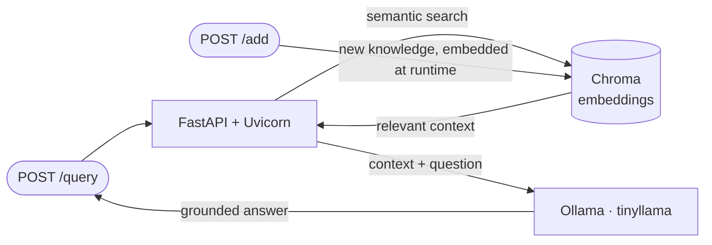

# Build a RAG API with FastAPI

> A Retrieval-Augmented Generation API built from scratch: FastAPI endpoints in front of a Chroma vector store and a local Ollama LLM, grounding answers in a knowledge base — **including a `/add` endpoint for updating knowledge at runtime without re-embedding scripts**.

*Part 1 of a 3-stage series: **build** → [containerize](../rag-api-docker) → [deploy to Kubernetes](../rag-api-kubernetes).*

## 🎯 The Problem

A bare LLM confidently hallucinates about anything outside its training data — useless for answering questions about *your* documents. RAG fixes this by retrieving relevant context from a knowledge base and feeding it to the model with the question, so answers are grounded in real content.

## 🏗️ How It Works

## 🔧 What I Built

- **An isolated Python workspace** (virtualenv) with the four core packages: `fastapi`, `chromadb`, `ollama`, `uvicorn`.
- **An embedding pipeline** (`embed.py`) converting knowledge-base documents into vectors stored in Chroma.
- **The RAG query flow** — search Chroma for context relevant to the question, combine context + question into a prompt, generate the answer with tinyllama running locally via Ollama.
- **Verified via curl and Swagger UI** — FastAPI's auto-generated interactive docs used to exercise every endpoint.
- **A `/add` endpoint** (extension) that embeds new content into the knowledge base **through the API at runtime** — no file edits, no re-running embedding scripts.

## 📊 Results

| Metric | Outcome |
|---|---|
| Hallucination control | Answers grounded in retrieved knowledge-base context, not model memory |
| Inference cost | **$0** — fully local via Ollama, no cloud API |
| Knowledge updates | **Runtime** via `/add` — from "edit file + re-embed + restart" to one API call |
| API usability | Self-documenting endpoints via Swagger UI |

## 🧰 Skills Demonstrated

`FastAPI` · `RAG architecture` · `Vector embeddings` · `ChromaDB` · `Ollama` · `Uvicorn` · `API design`

---

Built by **Ahmed Tetteh** as part of a [NextWork](http://learn.nextwork.org/projects/ai-devops-api) track. ~3 hours. Next: [containerizing it with Docker →](../rag-api-docker)
