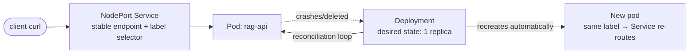

# Deploy a RAG API to Kubernetes

> The [containerized RAG API](../rag-api-docker) running under Kubernetes management — Deployment, Service, stable networking, and **self-healing proven by killing the pod and watching Kubernetes resurrect it** with zero manual intervention.

*Part 3 of a 3-stage series: [build](../rag-api-fastapi) → [containerize](../rag-api-docker) → **deploy to Kubernetes**.*

## 🎯 The Problem

A bare Docker container is fragile in production: if it crashes, someone has to notice and restart it; its IP changes on every restart, breaking consumers. Kubernetes solves both — a reconciliation loop keeps the desired number of replicas alive, and a Service gives traffic a stable endpoint no matter which pod is behind it.

## 🏗️ How It Works

*Client requests enter through a NodePort Service that routes by label selector to the `rag-api` pod. A Deployment's reconciliation loop holds the desired state of one replica, so when the pod crashes or is deleted, a new pod with the same label is created automatically and the Service re-routes to it.*

## 🔧 What I Built

- **A Minikube cluster** with `kubectl`, with the image loaded into **Minikube's isolated Docker daemon** (`eval $(minikube docker-env)`) — the classic local-cluster gotcha, solved properly.
- **A Deployment manifest** (`deployment.yaml`) declaring the image and replica count — Kubernetes' blueprint for keeping the API running.
- **A NodePort Service** (`service.yaml`) with a label selector, giving the ephemeral pods a stable, externally reachable endpoint with built-in routing.
- **End-to-end verification** — queried the API through the NodePort and traced the full request path: node port → Service → pod → container.
- **Self-healing demonstration** — deleted the pod and watched the reconciliation loop drive `Terminating → ContainerCreating → Running`; the Service re-routed to the replacement automatically because it matched by label, not by pod identity.
- **Real debugging** — resolved the pod-to-host networking failure where the in-cluster API couldn't reach Ollama on the host machine.

## 📊 Results

| Metric | Outcome |
|---|---|
| Crash recovery | **Automatic** — deleted pod replaced by the reconciliation loop, no human action |
| Service continuity | Traffic re-routed to the new pod via label selectors — consumers never re-configure |
| Desired-state management | Replica count enforced continuously, not just at deploy time |
| API behavior in-cluster | Identical grounded answers to the local and Docker versions |

## 🧰 Skills Demonstrated

`Kubernetes Deployments & Services` · `Minikube` · `kubectl` · `NodePort networking` · `Label selectors` · `Reconciliation/self-healing` · `Cluster-to-host networking debugging`

---

Built by **Ahmed Tetteh** as part of a [NextWork](http://learn.nextwork.org/projects/ai-devops-kubernetes) track. ~4 hours. The production-scale sequel: [GitOps with ArgoCD →](../../kubernetes/gitops-argocd-pipeline)
