# Amazon Aurora Cluster with EC2

> A MySQL-compatible Aurora cluster provisioned alongside the EC2 web host it serves — primary writer, read replicas, and key-pair-secured compute, set up in ~30 minutes.

*Part 1 of 2 — the app connection happens in [aurora-web-app](../aurora-web-app).*

## 🎯 The Problem

Self-managing a relational database on a VM means owning patching, replication, failover, and backups yourself. Aurora shifts that to AWS while keeping MySQL compatibility — but a database is useless in isolation: it has to be provisioned *together with* the compute that talks to it, with networking and authentication done right.

## 🏗️ Architecture

*The engineer connects over SSH (key pair with owner-only permissions) to a public EC2 web host with a configured security group. Writes go to the Aurora MySQL-compatible writer instance, and replication fans the data out to read replicas that spread SELECT load and stand by for failover.*

## 🔧 What I Built

- **An Aurora MySQL cluster** — a primary instance for writes plus read replicas that both spread `SELECT` load and act as standby copies, which is why Aurora is built around clusters rather than single nodes.
- **The EC2 web host mid-flight** — Aurora setup deliberately paused to create the connecting EC2 instance first (the cluster's connectivity settings want a target), with a **new SSH key pair** for authenticated access and attention to public IP, storage, and security-group configuration.
- **Cluster + compute wired together** so the instance can reach the database endpoint.

## 📊 Results

| Metric | Outcome |
|---|---|
| Provisioning time | **~30 minutes** for a replicated, managed MySQL cluster |
| Read scaling & durability | Read replicas double as load-spreaders and standbys |
| Database servers patched by hand | **Zero** — engine management is Aurora's job |

## 🧰 Skills Demonstrated

`Amazon Aurora` · `RDS cluster topology (writer/replicas)` · `EC2` · `SSH key pairs` · `Security groups`

---

Built by **Ahmed Tetteh** as part of a [NextWork](http://learn.nextwork.org/projects/aws-databases-aurora) track. Continued in [Connect a Web App with Aurora →](../aurora-web-app)
