# Containerized Web App on AWS Elastic Beanstalk


> A custom Nginx-based web app containerized with Docker, deployed to a fully managed AWS environment in ~10 minutes, with app updates shipped by re-upload — no servers configured by hand.

## 🎯 The Problem

Deploying even a simple web app traditionally means provisioning a server, installing a web server, configuring networking, and repeating all of it for every update. Containers + a managed platform collapse that: the app becomes a portable image, and AWS handles the instances, load balancing, and scaling underneath.

## 🏗️ Architecture



*A custom image — nginx base plus a custom `index.html` on port 80 — is built and tested locally with `docker run`, then zipped and uploaded to Elastic Beanstalk. AWS manages the EC2 instances, health checks, and scaling behind a live public URL, going from upload to live in about ten minutes; updates ship by re-uploading.*

## 🔧 What I Built

- **Docker fundamentals proven locally** — ran a stock Nginx container detached with port mapping (`docker run -d -p 80:80`), then a **custom image** from a 3-instruction Dockerfile: Nginx base → replace the default `index.html` with my own → expose port 80.
- **Real container debugging** — resolved a port-conflict error (old test container holding port 80) with proper container lifecycle commands instead of a reboot-and-pray.
- **Elastic Beanstalk deployment** — zipped the Dockerfile + app files, uploaded, and had a live public URL with the environment (EC2, health checks, scaling) fully managed.
- **The update workflow** — changed the app, re-zipped, used "Upload and deploy"; Beanstalk rebuilt and rolled out the new version with no environment reconfiguration.

## 📊 Results

| Metric | Outcome |
|---|---|
| Zero-to-live deployment | **~10 minutes** including environment launch |
| Servers configured manually | **Zero** — Beanstalk manages EC2, health checks, scaling |
| App update procedure | Re-zip + one-click deploy — no environment changes needed |
| Portability | Same image runs identically locally and in AWS |

## 💻 Source Code

The code behind this write-up — the Dockerfile and the page it serves — lives at **[kingswanzy2020/eb-docker-webapp](https://github.com/kingswanzy2020/eb-docker-webapp)**.

```bash
git clone https://github.com/kingswanzy2020/eb-docker-webapp.git
```

## 🧰 Skills Demonstrated

`Docker` · `Dockerfile` · `Port mapping & container lifecycle` · `Nginx` · `AWS Elastic Beanstalk` · `Managed platform deployment`

---

<sub>Built by **Ahmed Tetteh** as part of a [NextWork](http://learn.nextwork.org/projects/aws-compute-eb) track — [certificate](legendary-aws-compute-eb.pdf). ~3 hours.</sub>
