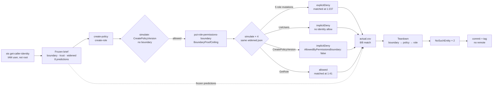

# IAM Permissions Boundary Proof


> A security-lead evidence package showing that a proposed policy widening **can grant `iam:CreatePolicyVersion` without a permissions boundary, and can't once the boundary is attached**. Eight decisions were predicted and frozen before any IAM resource existed, and the policy simulator confirmed all 8.

## 🎯 The Problem

"We attached a permissions boundary" is easy to say and hard to prove. Four ways that kind of claim goes wrong:

1. **No before picture.** A deny observed *after* the boundary proves nothing if the action was never reachable. Without an unbounded baseline, the boundary gets credit for a refusal it didn't cause.
2. **Every refusal looks the same.** In the console, an explicit deny, a missing allow, and a boundary ceiling all read as "Access Denied". A reviewer can't tell *which* control did the work, or whether the boundary did anything at all.
3. **Predictions shift after the results come in.** If expected outcomes are written after the simulator runs, a 100% match score is meaningless.
4. **Test resources outlive the test.** A role and a customer-managed policy left behind are exactly the kind of drift the review was meant to prevent.

This build answers all four. An **unbounded baseline** shows the widening is allowed. Four guarded simulations then **separate the four decision types** by rule and by the `AllowedByPermissionsBoundary` flag. All eight predictions were **committed to Git before the build**. And teardown ends with two `NoSuchEntity` reads before the evidence is sealed.

## 🏗️ Architecture



*The session starts by proving the caller is an administrative IAM user, not the account root. The design is then frozen in a local Git repository with no remote: the security lead's intent, a trust policy, the `BoundaryProofCeiling` boundary document, a proposed widening in `widened.json`, and eight predicted decisions. Only then are exactly two IAM resources created: the customer-managed policy and `BoundaryProofRole`, which carries no permissions policy of its own. `widened.json` is passed to `simulate-principal-policy` as local input only. With no boundary on the role, the simulator allows `iam:CreatePolicyVersion` against the boundary policy itself, so the risk is real. The policy is attached to the role as its permissions boundary, and the same widening is simulated four more times. Five privileged role mutations hit the widening's explicit Deny. `iam:ListUsers` is inside the ceiling but has no identity allow. `iam:CreatePolicyVersion` is allowed by the identity policy but refused by the ceiling. `iam:GetRole` passes both. Each result is scored against its frozen prediction in `actual.csv` and summarised in a self-contained HTML readout. Teardown runs in dependency order (boundary off, policy deleted, role deleted), and two fresh reads return `NoSuchEntity` before the final commit.*



**Flow:** checks 2 and 5 simulate the same action, against the same resource, with the same `widened.json`. The only thing that changes between them is the boundary, so the flip from `allowed` to `AllowedByPermissionsBoundary: false` belongs to the boundary alone.

## 🔧 Implementation Highlights

- **An unbounded control run before the boundary exists.** Check 2 simulates the widening against a bare role and gets `allowed`. Without it, check 5's refusal could just mean the action was never grantable, and the boundary would get credit it hadn't earned.
- **A boundary that deliberately omits the dangerous action.** `BoundaryProofCeiling` allows seven reviewed IAM actions, including the five role mutations and `iam:ListUsers`. It leaves out `iam:CreatePolicyVersion`. That is the escalation path: whoever can publish a new version of the boundary policy can raise their own ceiling.
- **Four decision types, each isolated by one test case.** Explicit deny, where the identity policy denies inside the ceiling. Implicit deny, where the ceiling allows but nothing grants. Boundary deny, where something grants but the ceiling refuses. And allowed, where both agree. Each has a different fix, so the readout names the *rule*, not just the outcome.
- **`AllowedByPermissionsBoundary: false` as the evidence, not `EvalDecision`.** The top-level decision for `CreatePolicyVersion` is `implicitDeny`, exactly the same as `ListUsers`. Only the `PermissionsBoundaryDecisionDetail` flag tells the two apart, so the requirements name that field as the proof.
- **Source positions, not Sids.** The simulator reports where a matched statement starts in the input (`1:237` for the deny block, `1:41` for the `GetRole` allow). It never returns the statement's `Sid`, and the brief explicitly forbids claiming it does.
- **The widening is never attached.** `widened.json` goes to `--policy-input-list` and nowhere else, and the role has no attached or inline policy at all. The whole graded path creates two resources and makes no live service calls.
- **Predictions committed before the build.** `predictions.csv` landed in `docs: freeze security brief design and predictions`, a commit before `build: create frozen IAM control case`. The Git history is the proof that 8/8 wasn't back-filled.
- **Dependency-ordered teardown with proof of absence.** The boundary is removed before its policy is deleted, because IAM refuses to delete a policy that is still set as a boundary. Two `NoSuchEntity` reads then confirm nothing was left behind.
- **Decision records with reversal triggers.** Examples: direct CLI calls over scripts (reverse when tested automation arrives), simulator over live calls (reverse when an isolated integration account exists), and local Git only (reverse when the security lead asks for team review).

## 📊 Results & KPIs

| Metric | Outcome |
|---|---|
| Frozen predictions confirmed | **8 / 8** exact matches |
| Unbounded baseline | `iam:CreatePolicyVersion` → **allowed** |
| Same widening, boundary attached | **implicitDeny** with **`AllowedByPermissionsBoundary: false`** |
| Explicit denies | **5 / 5** privileged role mutations, all matched at source position **1:237** |
| Ordinary implicit deny | `iam:ListUsers`, boundary flag **true**, no matched statement |
| Allowed control | `iam:GetRole` **allowed** through both identity policy and boundary |
| IAM resources created | **2** (one policy, one role), both confirmed deleted with **`NoSuchEntity`** |
| Graded-path cost | **0.00 USD** (IAM and the policy simulator are free) |
| Build time | **~90 minutes**, against a 45-minute phase plan |

## 📸 Proof

| Unbounded baseline: the widening is allowed | Security-lead readout: 8/8 with limits stated |
|---|---|
|  |  |

| Teardown: role and policy both return NoSuchEntity | Evidence workspace: local Git, no remote |
|---|---|
|  |  |

More screenshots in [`Screenshots/`](Screenshots).

### 🐛 What actually broke

- **`--policy-input-list` wants strings, not objects.** Passing the widened policy as an ordinary JSON document fails. The CLI expects a list of policy *strings*, so `widened.json` became a one-element array holding the escaped document. Getting there took the longest of any step.
- **The seal tag landed one commit early.** The close-out ran `git commit` then `git tag -a v1.0.0`, but the tag had already been created at the adjudication commit, so the command failed with `fatal: tag 'v1.0.0' already exists`. So `v1.0.0` points at `test: adjudicate eight frozen predictions`, *before* the teardown commit. That contradicts `check-manifest.md`'s closing line, "the final tag was created only after teardown evidence existed". The tag was left where it landed and the discrepancy is documented rather than quietly moved.
- **Teardown proof lives in a screenshot, not the repo.** Every other check pasted full output into `results/`. The two `NoSuchEntity` reads were only captured on screen, so the committed evidence set is one artifact short of what the after-action review claims.

## 💻 Source Code

The code behind this write-up — `boundary.json`, `trust.json`, and the string-encoded `widened.json`; the frozen `predictions.csv`; complete simulator output for all six checks under `results/` with the scored `actual.csv`; the self-contained `readout.html`; and the requirements, decision records, and after-action review under `docs/` — lives at
**[kingswanzy2020/iam-boundary-proof](https://github.com/kingswanzy2020/iam-boundary-proof)**.

```bash
git clone https://github.com/kingswanzy2020/iam-boundary-proof.git
```

The published copy redacts the account ID to `111122223333` and IAM unique IDs to AWS example values, across the full history. The replacements are the same length as the originals, so the simulator's reported source positions still line up.

## 🧰 Skills Demonstrated

`AWS IAM` · `Permissions boundaries` · `IAM policy evaluation logic` · `simulate-principal-policy` · `Explicit vs implicit vs boundary deny` · `Privilege-escalation analysis` · `JSON policy authoring` · `AWS CLI` · `Pre-registered predictions` · `Evidence-driven security review` · `Dependency-ordered teardown` · `Architecture Decision Records` · `Git as an audit trail`

---

<sub>Built by **Ahmed Tetteh** ([kingsleyswanzy@gmail.com](mailto:kingsleyswanzy@gmail.com)) as part of a [NextWork](https://nextwork.ai/projects/e2e44316-c623-4228-b9e7-408e55294a50) track, then extended — [certificate](certificate.pdf). ~90 minutes of hands-on build.</sub>
