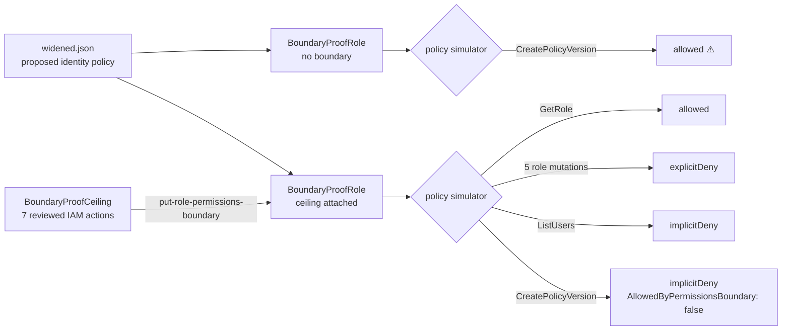

# IAM Permissions Boundary as a Role Ceiling


> A customer-managed policy attached as an IAM role's permissions boundary **sets the maximum permissions that role can ever have, whatever its identity policies say**. The IAM policy simulator runs the same widened identity policy against the role before and after the boundary is attached. `iam:CreatePolicyVersion` goes from **allowed** to **denied by the boundary**.

## 🎯 The Problem

Identity policies grow. Each change gets reviewed on its own merits, and nothing stops a later change from handing a role more than anyone intended:

1. **One added statement is enough to escalate.** A widening that grants `iam:CreatePolicyVersion` lets a role publish a new default version of a customer-managed policy, including the policy meant to restrict it.
2. **Reviewing every future policy change doesn't scale.** A permissions ceiling has to hold *regardless* of what gets attached to the role later, not only when a reviewer catches it.
3. **Boundaries are easy to misread.** A boundary doesn't grant anything, and it can't override an explicit Deny. Treat it as either and you get a role that can do less or more than you think.
4. **Testing by doing is risky.** Firing real IAM mutations to see whether they're blocked changes the account you're trying to protect.

This build sets `BoundaryProofCeiling` as the permissions boundary on `BoundaryProofRole`. It then uses `simulate-principal-policy` to evaluate a proposed widened identity policy against the role twice, once with no boundary and once with the ceiling in place. The widening is only ever simulator input and is never attached, so every decision is observed without a live IAM change.

## 🏗️ Architecture


*`widened.json` is a proposed identity policy for `BoundaryProofRole`. It allows `iam:GetRole` and `iam:CreatePolicyVersion`, and explicitly denies five privileged role mutations. The role itself trusts `ec2.amazonaws.com` with no instance profile and has no attached or inline policies, so nothing can assume it and it holds no permissions of its own. **Before:** the widening goes to the policy simulator with the role as the policy source. With no boundary on the role, the identity policy decides alone, and `iam:CreatePolicyVersion` against `BoundaryProofCeiling` comes back `allowed`. **After:** `put-role-permissions-boundary` sets `BoundaryProofCeiling` as the role's boundary. That policy allows seven reviewed IAM actions and leaves `iam:CreatePolicyVersion` out. The same widening is simulated again, and each action now resolves against the intersection of identity policy and ceiling. `iam:GetRole` is in both and stays allowed. The five role mutations are inside the ceiling but still hit the identity policy's explicit Deny. `iam:ListUsers` is inside the ceiling but granted by nothing, so it's an implicit deny. `iam:CreatePolicyVersion` is granted by the identity policy but sits above the ceiling, so the simulator returns `implicitDeny` with `AllowedByPermissionsBoundary: false`. Teardown removes the boundary first, then deletes the policy and the role.*



**Flow:** the role, the identity policy, the action, and the resource are identical in both runs. The boundary is the only thing that changes, so the flip from `allowed` to `AllowedByPermissionsBoundary: false` comes from the ceiling alone.

### How the ceiling decides

| Action | Identity policy (`widened.json`) | Ceiling (`BoundaryProofCeiling`) | Result with boundary | What it shows |
|---|---|---|---|---|
| `iam:GetRole` | Allow | Allow | **allowed** | Needs both: inside the ceiling *and* granted |
| `iam:DeleteRole`, `DeleteRolePermissionsBoundary`, `UpdateAssumeRolePolicy`, `PutRolePolicy`, `TagRole` | Deny | Allow | **explicitDeny** | The ceiling can't override an explicit Deny |
| `iam:ListUsers` | — | Allow | **implicitDeny** | The ceiling grants nothing on its own |
| `iam:CreatePolicyVersion` | Allow | — | **implicitDeny**, boundary `false` | Granted, but above the ceiling |

## 🔧 Implementation Highlights

- **A boundary written as a ceiling, not a grant.** `BoundaryProofCeiling` allows seven reviewed IAM actions on `*`. Because the role has no permissions policy attached, the boundary alone lets the role do nothing. The `iam:ListUsers` case shows this: inside the ceiling, nothing grants it, so it's denied.
- **`iam:CreatePolicyVersion` left above the ceiling on purpose.** It's the escalation path. The simulated resource is `BoundaryProofCeiling` itself, the case where a role publishes a looser version of the policy that bounds it. That's the one action the ceiling has to stop.
- **The same widening, before and after.** The unbounded run matters as much as the bounded one. Without it, the later deny could just mean the action was never grantable, and the boundary would get credit it didn't earn.
- **Evaluate against the role without attaching anything.** `simulate-principal-policy --policy-source-arn <role> --policy-input-list file://widened.json` evaluates a proposed identity policy in the context of the role, *including the role's current boundary*. The widening never touches a live principal.
- **Explicit Deny inside the ceiling.** The five role mutations are allowed by the boundary but denied by the identity policy. This shows the two layers compose: the ceiling limits the maximum, and a Deny below it still wins. Among them is `iam:DeleteRolePermissionsBoundary`, which would otherwise let a role strip its own ceiling.
- **Reading `AllowedByPermissionsBoundary`, not just `EvalDecision`.** With the boundary attached, `iam:CreatePolicyVersion` and `iam:ListUsers` both return `implicitDeny`. Only the `PermissionsBoundaryDecisionDetail` flag (`false` vs `true`) shows the ceiling caused one and a missing grant caused the other.
- **An inert role.** The trust policy names `ec2.amazonaws.com` with no instance profile, so the role exists as a policy source and a boundary target but can't actually be assumed while the test runs.
- **Dependency-ordered teardown.** IAM won't delete a policy that's still in use as a boundary. The boundary is removed first, then the policy and the role are deleted, and two `NoSuchEntity` reads confirm both are gone.
- **Expected outcomes written first.** All eight decisions went into `predictions.csv` and were committed before the role or policy existed, then scored against the simulator output: **8/8**.

## 📊 Results & KPIs

| Metric | Outcome |
|---|---|
| `iam:CreatePolicyVersion`, no boundary | **allowed** |
| `iam:CreatePolicyVersion`, ceiling attached | **implicitDeny**, **`AllowedByPermissionsBoundary: false`** |
| Allowed inside the ceiling | `iam:GetRole` stays **allowed** |
| Explicit Deny inside the ceiling | **5 / 5** role mutations **explicitDeny**, boundary flag `true` |
| Ceiling without a grant | `iam:ListUsers` **implicitDeny**, boundary flag `true` |
| Expected vs simulated decisions | **8 / 8** match |
| IAM resources created | **2** (one policy, one role), both confirmed deleted with **`NoSuchEntity`** |
| Cost | **0.00 USD** (IAM and the policy simulator are free) |
| Build time | **~90 minutes** |

## 📸 Proof

| Before the boundary: `CreatePolicyVersion` allowed | After: every case scored, limits stated |
|---|---|
|  |  |

| Teardown: role and policy both return NoSuchEntity | Design files frozen before the build |
|---|---|
|  |  |

More screenshots in [`Screenshots/`](Screenshots).

### 🐛 What actually broke

- **`--policy-input-list` wants strings, not objects.** Passing the widened policy as an ordinary JSON document fails. The CLI expects a list of policy *strings*, so `widened.json` became a one-element array holding the escaped document. That took longer than any other step.
- **The seal tag landed one commit early.** At close-out, `git tag -a v1.0.0` failed with `fatal: tag 'v1.0.0' already exists`. The tag had already been created at the adjudication commit, so it points *before* the teardown commit. That contradicts the closing line of `results/check-manifest.md`. The tag was left where it landed, and the discrepancy is documented.
- **Teardown output lives in a screenshot, not the repo.** Every other check pasted full output into `results/`. The two `NoSuchEntity` reads were only captured on screen.

## 💻 Source Code

The code behind this write-up — the `boundary.json` ceiling, the `trust.json` role trust policy, and the string-encoded `widened.json` identity policy; full simulator output for the before and after cases under `results/`; and the requirements, decision records, and topology under `docs/` — lives at
**[kingswanzy2020/iam-boundary-proof](https://github.com/kingswanzy2020/iam-boundary-proof)**.

```bash
git clone https://github.com/kingswanzy2020/iam-boundary-proof.git
```

The published copy redacts the account ID to `111122223333` and IAM unique IDs to AWS example values.

## 🧰 Skills Demonstrated

`AWS IAM` · `Permissions boundaries` · `Permission ceilings for IAM roles` · `IAM policy evaluation logic` · `simulate-principal-policy` · `Explicit vs implicit vs boundary deny` · `Privilege-escalation analysis` · `JSON policy authoring` · `AWS CLI` · `Dependency-ordered teardown` · `Architecture Decision Records`

---

<sub>Built by **Ahmed Tetteh** ([kingsleyswanzy@gmail.com](mailto:kingsleyswanzy@gmail.com)) as part of a [NextWork](https://nextwork.ai/projects/e2e44316-c623-4228-b9e7-408e55294a50) track, then extended — [certificate](certificate.pdf). ~90 minutes of hands-on build.</sub>
