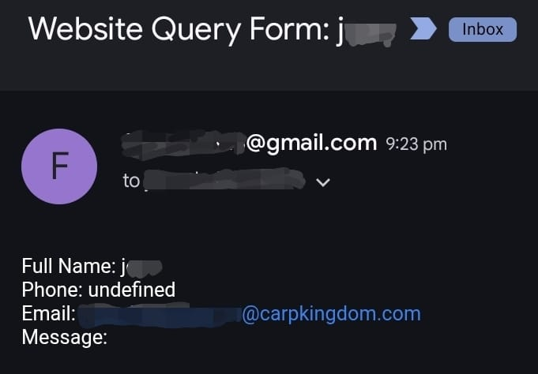
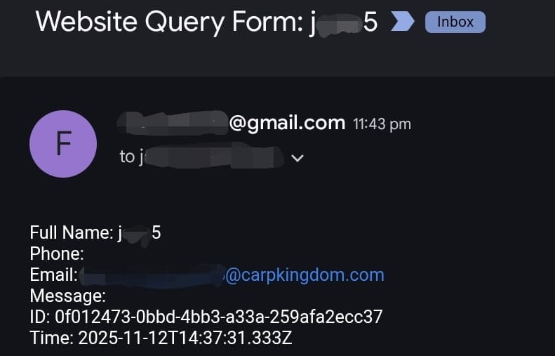

# 📚 Serverless eBook Lead Capture Platform on AWS

> A production-grade, fully serverless, globally distributed eBook download platform built on AWS cloud-native services — no servers provisioned, no infrastructure managed.


---

## 🌐 Production Deployment

Ran in production at the custom domain **`kahmedt.com`** — served globally via CloudFront with SSL enforced. The project is complete and the infrastructure has since been decommissioned; the screenshots below document the live system.

| Homepage (S3 + CloudFront) | Secure Custom Domain |
|---|---|
|  |

---

## 📌 What This Project Does

A visitor lands on the eBook website, fills in their name and email, and clicks **"Download Ebook"**. At that moment, a fully serverless backend:

1. **Sends an instant email notification** to the business owner via Amazon SES
2. **Stores the lead's contact details** (name, email, timestamp, UUID) in DynamoDB
3. **Logs the full event** in Amazon CloudWatch for observability

Zero servers. Zero polling. Pure event-driven cloud architecture.

---

## 🎯 The Problem

A small business wanted to capture e-book leads without paying for — or patching, scaling, and securing — an always-on web server for what amounts to 10–15 form submissions a day. Traditional hosting means idle cost, maintenance burden, and a single point of failure for a workload that is bursty and tiny.

**The result:** a globally distributed platform with **near-$0 idle cost** (pay-per-invocation Lambda + on-demand DynamoDB), **HTTPS enforced end-to-end**, **instant lead notification** via SES, and **zero servers to patch** — deployed to production at `kahmedt.com` (since decommissioned after the project wrapped up).

---

## 🏗️ Architecture


### How It Flows

```
User
 └─▶ Route 53 (DNS)
      └─▶ CloudFront (CDN + HTTPS via ACM)
           └─▶ S3 (Static Website: HTML/CSS/JS)
                └─▶ [On form submit] AJAX POST
                     └─▶ API Gateway (REST — /epicreads_resource)
                          └─▶ Lambda (epicreads_contactus)
                               ├─▶ SES ──▶ Email Notification ──▶ Business Owner
                               ├─▶ DynamoDB ──▶ Lead Stored
                               └─▶ CloudWatch ──▶ Execution Logged
```

---

## ☁️ AWS Services Used

| Service | Role | Phase |
|---|---|---|
| **Amazon S3** | Static website hosting with bucket policy for public read | Phase 1 |
| **Amazon CloudFront** | Global CDN, HTTPS termination, edge caching | Phase 1 |
| **Amazon Route 53** | DNS hosted zone, A record aliased to CloudFront | Phase 1 |
| **AWS Certificate Manager** | Free SSL/TLS certificate (issued in `us-east-1`) | Phase 1 |
| **Amazon API Gateway** | REST API endpoint, CORS enabled, POST method | Phase 2 |
| **AWS Lambda** | Node.js handler — orchestrates SES + DynamoDB | Phase 2 |
| **Amazon SES** | Transactional email to business owner | Phase 2 |
| **Amazon DynamoDB** | NoSQL storage for all captured lead data | Phase 3 |
| **AWS IAM** | Least-privilege roles and inline policies for Lambda | All |
| **Amazon CloudWatch** | Execution logs and monitoring for Lambda | All |

---

## 🔐 Security Design

- **HTTPS enforced** on all traffic — HTTP not permitted (CloudFront + ACM)
- **IAM least-privilege** — Lambda role has only `dynamodb:PutItem` and `ses:SendEmail` permissions
- **Inline IAM policy** used for DynamoDB access — automatically cleaned up with the role
- **No backend servers** exposed to the public internet
- **Verified SES sender identities** — spoofing prevented
- **CORS scoped** — configured per API Gateway resource (not wildcard in production)

---

## 📸 Image

### Download Form — Customer Side


*User enters name and email, clicks "Download Ebook". The AJAX call fires to API Gateway.*

---

### Email Received — Business Owner

| Initial Test | With Full Metadata (DynamoDB Phase) |
|---|---|
|  |

*Business owner receives instant email via SES including: Full Name, Email, unique UUID, and ISO 8601 timestamp.*

---

### Lambda Function — AWS Console


*`epicreads_contactus` — the core Lambda function. Triggered by API Gateway. Integrates SES and DynamoDB via the AWS SDK v3 (ES Module syntax).*

---

### API Gateway — POST Method


*REST API: `EpicReads_api` → `/epicreads_resource` → `POST` method → Lambda integration. CORS enabled for cross-origin form submissions from the S3/CloudFront hosted frontend.*

---

## 🗃️ DynamoDB Schema

**Table:** `ContactMessages`

| Attribute | Type | Notes |
|---|---|---|
| `id` | String | Partition Key — `randomUUID()` |
| `name` | String | Lead's full name |
| `email` | String | Lead's email address |
| `timestamp` | String | ISO 8601 format |

---

## 💻 Cloudwatch(Monitoring)
CloudWatch monitors the Lambda function and API Gateway


---
## 📁 Repository Structure

```
├── Ebook                                  ← Frontend Website
├── Extra
│   ├── 404.html                           ← Error page
│   └── Lambda function(Core Logic).js     ← Sample Lambda function
└── Serverless Lead Capture AWS            ← Project Ppt
└── README.md                              ← This file
```

## ⚠️ Challenges & How I Solved Them

| Challenge | Root Cause | Solution |
|---|---|---|
| S3 bucket not accessible publicly | Default Block Public Access settings | Wrote explicit bucket policy granting `s3:GetObject` to `*` |
| Route 53 alias record couldn't target S3 | Bucket name didn't match domain name | Switched to CloudFront origin — best practice anyway |
| CloudFront rejected the ACM certificate | Certificate was in wrong region | Re-issued certificate in `us-east-1` (required for CloudFront globally) |
| Custom domain nameservers not propagating | NS records not updated at registrar | Copied all 4 NS records from Route 53 hosted zone to domain registrar |
| CORS errors on form submission | API Gateway not returning CORS headers | Enabled CORS on API Gateway resource; Lambda returns `Access-Control-Allow-Origin` header |
| Lambda couldn't write to DynamoDB | Missing IAM permissions | Added inline `dynamodb:PutItem` policy to Lambda execution role |

---

## 📊 Performance & Scale

| Metric | Value |
|---|---|
| Target active users | ~500 |
| Expected downloads/day | 10–15 |
| Content delivery | Global via CloudFront edge locations |
| Backend compute | Serverless (Lambda auto-scales) |
| Storage | DynamoDB on-demand (no provisioned capacity needed) |
| Cost model | Pay-per-invocation (near $0 at this scale) |

---

## 🚀 Deployment

### Prerequisites

- AWS Account with appropriate IAM permissions
- A registered domain (for Route 53 + custom domain setup)
- Verified SES email identities (sender + receiver)

### Steps

```bash
# 1. Clone the repository
git clone https://github.com/kingswanzy2020/serverless-ebook-lead-capture.git
cd serverless-ebook-lead-capture

# 2. Upload frontend to S3
aws s3 sync . s3://YOUR_BUCKET_NAME --exclude ".git/*" --exclude "README.md"

# 3. Deploy Lambda function via AWS Console or CLI
# Set environment variables: AWS_REGION, TABLE_NAME, RECEIVER_EMAIL, SENDER_EMAIL

# 4. Create API Gateway REST API → POST method → Lambda integration
# Enable CORS on the resource

# 5. Create DynamoDB table "ContactMessages" with "id" (String) as partition key

# 6. Point CloudFront to S3, attach ACM certificate, configure Route 53 alias
```

---

## 🛣️ Roadmap & Future Improvements

- [ ] **CI/CD Pipeline** — GitHub Actions for automated S3 sync on push
- [ ] **Infrastructure as Code** — Terraform or CloudFormation for full reproducibility
- [ ] **AWS WAF** — Web Application Firewall to block malicious requests
- [ ] **CAPTCHA Integration** — Prevent spam form submissions
- [ ] **Analytics Dashboard** — QuickSight or CloudWatch dashboard for download metrics
- [ ] **SES Production Mode** — Move out of sandbox for unrestricted sending
- [ ] **Custom Email Templates** — HTML email receipts for the downloader

---

## 📚 Key Learnings

- Designed and deployed a **production-grade serverless architecture** end-to-end
- Understood the **DNS → CDN → SSL validation workflow** from scratch (including the ACM `us-east-1` constraint for CloudFront)
- Learned **event-driven backend integration** with Lambda as the orchestration layer
- Applied **IAM least-privilege principles** — inline policy for scoped, ephemeral permissions
- Debugged real **CORS issues** between a static frontend and a serverless API
- Gained experience with **AWS SDK v3** (modular ES Module imports, DynamoDB DocumentClient)

---

## 👤 Author

**Ahmed Tetteh**  
Cloud & DevOps Enthusiast

[](https://www.linkedin.com/in/ahmed-tetteh-76a538126/)
[](https://github.com/kingswanzy2020)

---

## 📄 License and Attribution

This project is open source. The frontend template is developed by **TemplateMo** — please review the [TemplateMo license](https://templatemo.com/license) for permitted use and attribution requirements.

---

> *"The best infrastructure is the infrastructure you never have to manage."*

