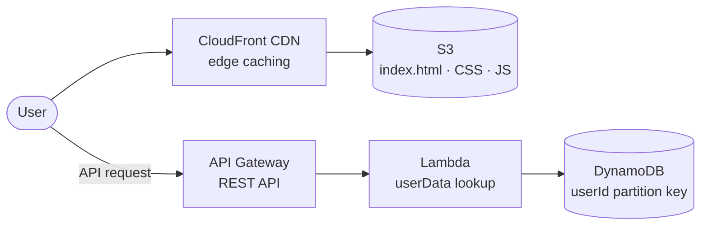

# Three-Tier Web Architecture on AWS

> The classic three-tier pattern built serverless: a CloudFront-delivered frontend, an API Gateway + Lambda logic tier, and a DynamoDB data tier — assembled as three modules and wired into one architecture.

## 🎯 The Problem

Monolithic "everything on one server" apps can't scale their tiers independently and fail all at once. The three-tier pattern separates presentation, logic, and data so each layer scales, fails, and evolves on its own — and building it serverless removes the servers from all three tiers.

## 🏗️ Architecture

## 📦 The Three Tiers

| Tier | Module | What it does |
|---|---|---|
| **Presentation** | [Website delivery with CloudFront](<Website delivery with CloudFront>) | S3-hosted static site behind CloudFront, with bucket access locked to the distribution via **Origin Access Control** — solved the access-denied path properly instead of making the bucket public |
| **Logic** | [APIs with Lambda + API Gateway](<APIs with Lambda + API Gateway>) | REST API resources/methods in API Gateway fronting a Lambda that parses `queryStringParameters` and returns proper `200`/`404` responses |
| **Data** | [Fetch Data with AWS Lambda](<Fetch Data with AWS Lambda>) | Schemaless DynamoDB table keyed on `userId`, read by Lambda through a least-privilege **execution role** |

Each module folder contains its full step-by-step write-up and screenshots.

## 📊 Results

| Metric | Outcome |
|---|---|
| Servers managed across all three tiers | **Zero** |
| Frontend delivery | Cached at CloudFront edge locations — S3 origin locked to the CDN via OAC |
| API behavior | Correct REST semantics verified: `200` on hit, `404` + error message on miss |
| Data access security | Lambda reads DynamoDB via a scoped execution role — no embedded credentials |
| Total build time | ~5.5 hours across the three modules |

## 🧰 Skills Demonstrated

`CloudFront + OAC` · `S3` · `API Gateway (REST)` · `AWS Lambda` · `DynamoDB` · `IAM execution roles` · `Serverless architecture design`

---

Built by **Ahmed Tetteh** as part of NextWork's three-tier architecture series. The production sequel to this pattern: [Serverless Lead Capture, live at kahmedt.com](../serverless-lead-capture).
