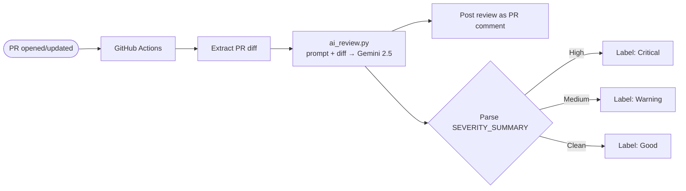

# AI-Powered Pull Request Review with Gemini

> Every pull request gets an instant AI security review: a Gemini-powered script analyzes the diff, posts findings as a PR comment, and **auto-labels the PR by severity** — before a human reviewer even opens it.

## 🎯 The Problem

Human code review is the biggest bottleneck in most teams' delivery flow — PRs queue for hours or days, and under time pressure reviewers miss exactly the things that hurt most: injection vulnerabilities, leaked credentials, resource leaks. The wait is expensive; the misses are worse.

## 🏗️ How It Works

*Opening or updating a pull request triggers GitHub Actions to extract the PR diff and hand it to `ai_review.py`, which sends prompt + diff to Gemini 2.5. The security findings are posted back as a review comment on the PR, and the parsed `SEVERITY_SUMMARY` auto-applies a Critical, Warning, or Good label.*

## 🔧 What I Built

- **A Python review script** that feeds the PR diff to Gemini 2.5 with a structured reviewer prompt, tested locally against sample diffs before automation.
- **A PR-triggered workflow**: checkout → diff extraction → AI review → comment posted via `github-script`.
- **Machine-readable severity output** — the prompt requires a `SEVERITY_SUMMARY` line the workflow parses to auto-apply **Critical / Warning / Good** labels, so reviewers triage at a glance.
- **Secure key handling** — the Gemini API key lives in GitHub Secrets and is injected as an environment variable; nothing sensitive in the workflow YAML or repo.
- **Dogfooded on itself** — the reviewer flagged a shell-injection risk and a hardcoded-key risk *in my own script*; I fixed both (disabled the shell interpreter, moved the key to an env var) and the re-review confirmed it.

## 📊 Results

| Metric | Outcome |
|---|---|
| Review latency | **Instant** — findings posted before a human opens the PR |
| Real vulnerabilities caught | **SQL injection** and **shell injection** detected in test diffs |
| Triage effort | Auto-labels sort PRs by AI-assessed severity |
| Credential exposure | **Zero** — API key in GitHub Secrets only |

## 🧰 Skills Demonstrated

`GitHub Actions` · `LLM API integration` · `Prompt design for structured output` · `github-script` · `Secrets management` · `Security review automation`

---

Built by **Ahmed Tetteh** as part of a [NextWork](http://learn.nextwork.org/projects/ai-cicd-codereview) track, then extended with severity auto-labeling. ~4 hours.
