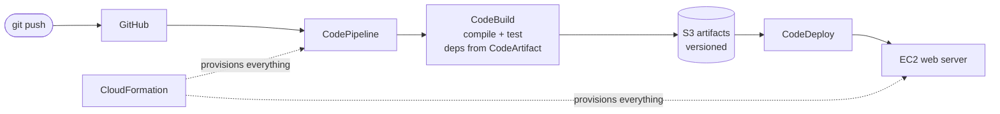

# 7-Day AWS CI/CD Pipeline Challenge


> A complete AWS-native delivery pipeline built in 7 consecutive days: a Java web app that goes from `git push` to a live EC2 deployment with **no manual steps and no public package registries** — the whole stack reproducible from one CloudFormation template.

## 🎯 The Problem

Manual release coordination — someone builds locally, copies artifacts to a server, restarts things by hand — is slow, error-prone, and unrepeatable. This challenge builds the full AWS answer to that, one layer per day, ending with a pipeline where a commit to `main` deploys itself.

## 🏗️ The Pipeline



*A commit pushed to main webhooks from GitHub into CodePipeline, which orchestrates every stage: CodeBuild compiles and tests using private dependencies from CodeArtifact (no public registries), drops a versioned artifact in S3, and CodeDeploy automates the rollout to the EC2 web server running the live Java app — with CloudFormation able to provision the whole stack from one template.*




## 📅 Day by Day

| Day | Deliverable | Detailed log |
|---|---|---|
| 1 | Java web app on an EC2 cloud dev environment | [Day 1](<Day 1-Set Up a Web App in the Cloud>) |
| 2 | GitHub repo wired to the AWS environment | [Day 2](<Day 2-Connect a GitHub Repo with AWS>) |
| 3 | Private dependency management with CodeArtifact | [Day 3](<Day 3 -Secure Packages with CodeArtifact>) |
| 4 | Continuous integration with CodeBuild | [Day 4](<Day 4- Continuous Integration with CodeBuild>) |
| 5 | Automated deployment with CodeDeploy | [Day 5](<Day 5-Deploy a Web App with CodeDeploy>) |
| 6 | Entire infrastructure as a CloudFormation template | [Day 6](<Day 6-Infrastructure as Code with CloudFormation>) |
| 7 | Everything joined into one CodePipeline | [Day 7](<Day 7- Build a CI_CD Pipeline with AWS>) |

## 📊 Results

| Metric | Outcome |
|---|---|
| Manual steps from commit to deployment | **Zero** — CodePipeline orchestrates source → build → deploy |
| Deployment frequency | **~60% higher** once release friction was removed |
| Supply-chain exposure | **Closed** — builds pull dependencies from a private CodeArtifact mirror, never public registries |
| Environment reproducibility | **One command** — pipeline, EC2, and networking from a single CloudFormation template |
| Failed-release recovery | Versioned S3 artifacts + CodeDeploy rollback hooks |

## 💻 Source Code

The code behind this write-up — the Java web app, `buildspec.yml`, `appspec.yml`, the CodeDeploy lifecycle scripts, and the CloudFormation templates for the whole pipeline stack — lives at **[kingswanzy2020/nextwork-web-project](https://github.com/kingswanzy2020/nextwork-web-project)**.

```bash
git clone https://github.com/kingswanzy2020/nextwork-web-project.git
```

## 🧰 Skills Demonstrated

`AWS CodePipeline` · `CodeBuild` · `CodeDeploy` · `CodeArtifact` · `CloudFormation` · `EC2` · `S3` · `IAM` · `Java/Maven`

---

<sub>Built by **Ahmed Tetteh** over 7 days (~5 hrs/day) as part of the [NextWork](http://learn.nextwork.org/projects/aws-devops-cicd) DevOps challenge — [certificate](<Overview/legendary-aws-devops-cicd.pdf>).</sub>
