# CI Pipeline Fundamentals with GitHub Actions

> A complete CI workflow from scratch: pytest suite, push/PR-triggered pipeline, and distributable build artifacts — proving bugs get caught in CI, not by users.

## 🎯 The Problem

Code that's only tested on the developer's laptop breaks in everyone else's hands. Without CI, a bad push sits unnoticed until a teammate pulls it or a user hits it — and without a build step, "it works here" never becomes a shippable package.

## 🏗️ Architecture

*Every push or PR to main triggers GitHub Actions to check out the code, set up Python, install dependencies, and run the 6-test pytest suite in an isolated virtualenv. A bad push (an intentional bug) is caught and blocked before merge; a green run builds the package and uploads a pip-installable `.whl`/`.tar.gz` CI artifact.*

## 🔧 What I Built

- **A tested Python module** — typed functions with a 6-test pytest suite, run in an isolated virtualenv.
- **A GitHub Actions CI workflow** triggered on every push and pull request to `main`: checkout → set up Python → install dependencies → run pytest.
- **Failure verification** — I intentionally broke an assertion and confirmed CI caught it and blocked the change, then fixed it and watched the pipeline go green.
- **Build artifacts** — a packaging step producing `.whl` and `.tar.gz` distributions uploaded as GitHub artifacts, installable anywhere with `pip install`.

## 📊 Results

| Metric | Outcome |
|---|---|
| Pushes/PRs tested automatically | **100%** — no untested code can merge quietly |
| Bug detection | **Verified** — an intentionally introduced bug failed CI before reaching main |
| Distribution | Every green build produces an **installable package artifact** |

Code lives at [kingswanzy2020/ai-cicd-github](https://github.com/kingswanzy2020/ai-cicd-github).

## 🧰 Skills Demonstrated

`GitHub Actions` · `pytest` · `Python packaging` · `CI artifacts` · `Virtual environments`

---

Built by **Ahmed Tetteh** as part of a [NextWork](http://learn.nextwork.org/projects/ai-cicd-github) track. ~2 hours.
