# Automated Semantic Testing for a RAG API with GitHub Actions

> A CI pipeline that catches **AI data-quality regressions** — not just code bugs — by running deterministic semantic tests against a RAG API's retrieval layer on every push.

## 🎯 The Problem

Traditional unit tests can't protect an AI application: the code can be perfectly correct while the *answers* silently degrade because someone edited the knowledge base. Worse, LLM output is non-deterministic — I proved this by removing the keyword "orchestration" from the knowledge base and still seeing it in generated answers, making naive response-checking tests unreliable.

## 🏗️ Architecture

*A path-filtered `ci.yml` triggers when `docs/`, `app.py`, or `embed.py` change: `embed_docs.py` re-embeds every document in the knowledge base, then semantic tests run in mock-LLM mode for deterministic retrieval checks. A pass marks the build green with retrieval quality verified; a fail blocks the regression so a degraded knowledge base never reaches production.*

## 🔧 What I Built

- **A FastAPI RAG service** (retrieve → augment → generate via Ollama) with a `/query` endpoint, verified locally before any automation.
- **A mock LLM mode** — the key engineering decision. Tests bypass the non-deterministic generation step and assert against the *raw retrieved context*, making semantic tests deterministic: same query, same result, every run.
- **Semantic tests** that verify expected keywords appear in retrieval results for known queries — validating data quality, not code logic.
- **A GitHub Actions workflow** (`.github/workflows/ci.yml`) that triggers when the knowledge base (`docs/`), `app.py`, or `embed.py` change, and fails the build on any retrieval regression.
- **Multi-document scaling** — restructured the knowledge base into a `docs/` folder with an `embed_docs.py` embedding pipeline, so CI validates every document as the knowledge base grows.

## 📊 Results

| Metric | Outcome |
|---|---|
| Data-quality regression detection | **Caught in CI** — deliberately degrading the knowledge base failed the build before deploy |
| Test determinism | **100%** via mock LLM mode — no flaky LLM-dependent assertions |
| Knowledge-base coverage | **Every document** in `docs/` validated on each push |
| Degraded content reaching production | **Blocked** at the build/test phase |

Code lives at [kingswanzy2020/nextwork-rag-api](https://github.com/kingswanzy2020/nextwork-rag-api).

## 🧰 Skills Demonstrated

`GitHub Actions` · `CI for AI systems` · `Semantic testing` · `FastAPI` · `RAG` · `Ollama` · `Test determinism design`

---

Built by **Ahmed Tetteh** as part of a [NextWork](http://learn.nextwork.org/projects/ai-devops-githubactions) track. ~3 hours including research.
