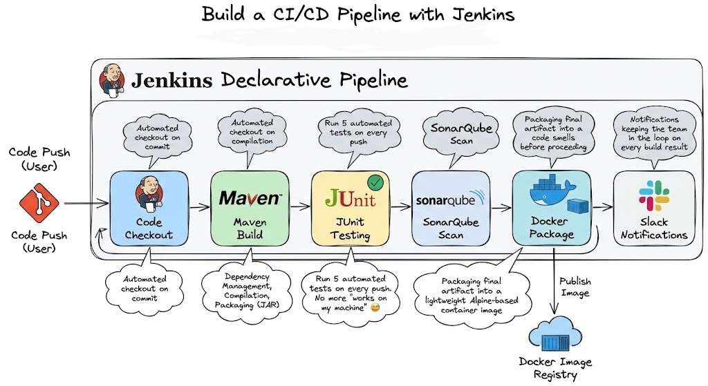
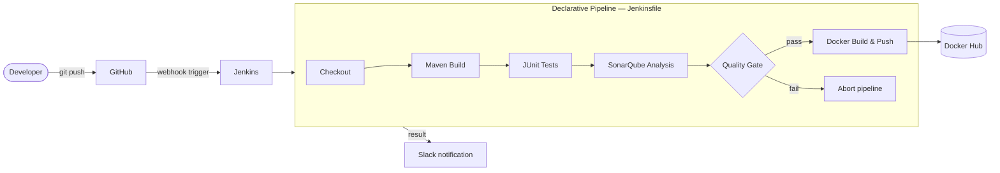

# CI/CD Pipeline with Jenkins, SonarQube & Docker


> A five-stage declarative Jenkins pipeline that **builds, tests, quality-gates, containerizes, and notifies** on every push — bad code physically cannot reach the registry.

## 🎯 The Problem

Manual build-and-review cycles are slow and inconsistent: developers push code, someone eventually builds it, tests get skipped under deadline pressure, and quality issues surface in production. Without an enforced quality gate, "we'll fix it later" code merges freely.

This pipeline makes quality **non-negotiable**: every commit is automatically built, unit-tested, statically analyzed, and blocked if it fails the SonarQube quality gate — with the team notified in Slack either way.

## 🏗️ Architecture



*A `git push` webhooks straight into Jenkins (no polling), whose declarative Jenkinsfile runs the Maven build, JUnit tests, and SonarQube static analysis. Only a passing quality-gate verdict lets the Docker image be built and pushed to Docker Hub; a failure aborts the pipeline so bad code never reaches the registry — and Slack is notified either way.*





## 🔧 Implementation Highlights

- **Pipeline-as-Code** — the entire workflow lives in a version-controlled `Jenkinsfile` next to the application code ([cicd-pipeline-app](https://github.com/kingswanzy2020/cicd-pipeline-app)), so pipeline changes are reviewed like any other change.
- **Enforced SonarQube quality gate** — Jenkins waits for SonarQube's webhook verdict; a failing gate **aborts the pipeline**, preventing vulnerable or low-quality code from ever being containerized.
- **GitHub webhook triggers** — no polling; every push starts the pipeline immediately.
- **JUnit results published regardless of outcome** via the `post { always }` block, so failed test reports are never swallowed.
- **Docker image build & push** to Docker Hub with credentials stored in Jenkins' credential manager (never in the repo).
- **Slack notifications on every run** — verified end-to-end by intentionally breaking a test and receiving the failure alert.
- **Linux kernel tuning for SonarQube** — configured `vm.max_map_count=262144` and `fs.file-max=131072` for the embedded Elasticsearch, which otherwise crashes silently at startup.

## 📊 Results & KPIs

| Metric | Outcome |
|---|---|
| Commits automatically built + tested | **100%** — webhook-triggered on every push |
| Feedback time (push → pass/fail verdict) | **Minutes**, vs. manual review cycles of hours/days |
| Sub-standard code reaching Docker Hub | **Zero** — quality gate aborts the pipeline on failure |
| Test visibility | JUnit reports published on **every** run, pass or fail |
| Team awareness | Slack alert on every success **and** failure — verified with a forced test failure |
| Credential exposure | **None** — SonarQube token & Docker Hub creds in Jenkins credential store |

## 📸 Proof

| All five stages green | Quality gate + analysis in SonarQube |
|---|---|
|  |  |

More screenshots in [`Screenshots/`](Screenshots).

## 💻 Source Code

The code behind this write-up — the Java/Maven application and the `Jenkinsfile` whose quality gate runs with `abortPipeline: true` — lives at **[kingswanzy2020/cicd-pipeline-app](https://github.com/kingswanzy2020/cicd-pipeline-app)**.

```bash
git clone https://github.com/kingswanzy2020/cicd-pipeline-app.git
```

## 🧰 Skills Demonstrated

`Jenkins` · `Declarative Pipelines` · `SonarQube` · `Quality Gates` · `Maven` · `JUnit` · `Docker` · `GitHub Webhooks` · `Slack integration` · `Linux tuning`

---

<sub>Built by **Ahmed Tetteh** ([kingsleyswanzy@gmail.com](mailto:kingsleyswanzy@gmail.com)) as part of a [NextWork](https://learn.nextwork.org/projects/f485c924-e7b8-4fed-ae38-23e5b876e063) track, then extended. ~4 hours of hands-on build.</sub>
