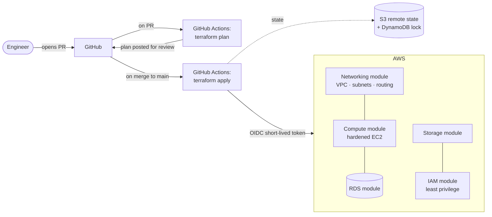

# Enterprise Terraform GitOps Pipeline


> A modular Terraform codebase provisioning a full AWS stack (VPC, EC2, S3, RDS, IAM) where **every infrastructure change is a reviewed `terraform plan` on a PR** and applies happen only on merge — authenticated to AWS with **zero stored credentials** via GitHub OIDC.

## 🎯 The Problem

Console-clicked infrastructure is a liability: it can't be reviewed, can't be reproduced, drifts silently, and the person who built it becomes a single point of failure. Worse, most CI setups store long-lived AWS keys as secrets — a rotation burden and a leak waiting to happen.

This pipeline treats infrastructure exactly like application code: modular, version-controlled, peer-reviewed before it touches AWS, and authenticated with short-lived OIDC tokens instead of static keys.

## 🏗️ Architecture



*An engineer opens a PR — never the console — and GitHub Actions posts the `terraform plan` diff for review. Merging to main runs `terraform apply`, which assumes an AWS role via GitHub OIDC (short-lived token, zero stored keys) to provision the five-module stack — VPC, hardened EC2, RDS, S3, IAM — with state kept in an S3 backend locked by DynamoDB.*



## 🔧 Implementation Highlights

- **Modular design** — separate networking, compute, storage, IAM, and RDS child modules composed by a root module, each reusable across environments.
- **Plan-on-PR, apply-on-merge** — the `plan` workflow runs on pull requests so reviewers see exactly what will change; `apply` runs only on merge to `main`. Errors are caught in review, not in production.
- **Passwordless AWS auth via GitHub OIDC** — GitHub Actions exchanges its identity token for short-lived AWS credentials. No static keys stored, nothing to rotate or leak.
- **Remote state with locking** — state in S3 with a DynamoDB lock table so concurrent runs can't corrupt it. I solved the classic **bootstrap problem** (Terraform can't manage the bucket its own state lives in) by provisioning the state resources once via AWS CLI, outside Terraform.
- **Security hardening baked into modules** — IMDSv2 enforced (`http_tokens = required`) against credential-theft attacks, encrypted root volumes, RDS security group admitting **only** the EC2 instance's security group, dynamic AZ discovery so modules work in any region.
- **Pre-commit hooks** — formatting, validation, and security misconfiguration checks run before code can even be committed.

## 📊 Results & KPIs

| Metric | Outcome |
|---|---|
| Infrastructure codified | **100%** — no console-clicked resources |
| Changes reviewed before touching AWS | **100%** — every PR carries its `terraform plan` output |
| Stored cloud credentials in CI | **Zero** — OIDC short-lived tokens only |
| State corruption from concurrent runs | **Prevented** — DynamoDB state locking |
| Environment spin-up | **Minutes via merge**, vs. hours of manual console work |
| Misconfigurations reaching the repo | Caught **pre-commit** by automated hooks |

## 📸 Proof

| Plan → merge → apply cycle in Actions | Deployed stack |
|---|---|
|  |  |

More screenshots in [`Screenshots/`](Screenshots).

## 💻 Source Code

The code behind this write-up — the module tree, the plan-on-PR and apply-on-merge workflows, and the IAM documents behind the GitHub Actions OIDC role — lives at **[kingswanzy2020/terraform-gitops](https://github.com/kingswanzy2020/terraform-gitops)**.

```bash
git clone https://github.com/kingswanzy2020/terraform-gitops.git
```

## 🧰 Skills Demonstrated

`Terraform modules` · `Remote state & locking` · `GitHub Actions` · `OIDC federation` · `AWS (VPC · EC2 · S3 · RDS · IAM · DynamoDB)` · `Least-privilege security groups` · `IMDSv2 hardening` · `Pre-commit automation`

---

<sub>Built by **Ahmed Tetteh** ([kingsleyswanzy@gmail.com](mailto:kingsleyswanzy@gmail.com)) as part of a [NextWork](https://learn.nextwork.org/projects/6cb68aee-7d57-4422-ba99-d99ceae892ae) track, then extended — [certificate](certificate.pdf). ~7 hours including the modular build and CI troubleshooting.</sub>
