# Provisioning S3 with Terraform — IaC Fundamentals


> The complete Terraform lifecycle — `init` → `plan` → `apply` — used to declare, review, provision, and evolve a locked-down S3 bucket and its objects entirely from code.

## 🎯 The Problem

Console-clicked resources can't be reviewed, versioned, or reproduced — and nobody remembers six months later why a bucket is configured the way it is. Infrastructure as code turns every resource into a readable, diffable text file.

## 🏗️ Architecture



*`main.tf` declares the provider, the bucket, and its public-access block. `terraform init` pulls provider plugins and sets up the state backend, `terraform plan` shows the exact diff for review before anything is created, and an approved `terraform apply` executes exactly what the plan showed — yielding a locked-down, owner-enforced S3 bucket with its objects.*

## 🔧 What I Built

- **A declarative `main.tf`** with three blocks: the AWS provider/region, the S3 bucket resource, and a public-access block locking the bucket down by default.
- **The full Terraform lifecycle**, understanding *why* the order matters: `init` (download provider plugins, create state backend and lock file) → `plan` (review the execution diff before anything is created) → `apply` (execute exactly what the plan showed).
- **Configuration evolution** — extended the config from the official Terraform registry docs to enforce **bucket-owner object ownership** regardless of who uploads, then added an `aws_s3_object` resource to upload files; re-ran `plan`/`apply` and verified the changes in the console.
- **CLI authentication** — configured AWS access keys for Terraform's provider to act against the account.

## 📊 Results

| Metric | Outcome |
|---|---|
| Resources provisioned by hand | **Zero** — bucket, access policy, ownership rules, and objects all from code |
| Change review | Every modification previewed with `terraform plan` before touching AWS |
| Reproducibility | The entire setup recreates from `main.tf` in one apply |
| Security default | Public access blocked at creation, not patched afterwards |

This project is the fundamentals layer under the [Enterprise Terraform GitOps Pipeline](../enterprise-terraform-gitops), which scales the same lifecycle to a modular multi-service AWS stack with CI/CD.

## 💻 Source Code

The code behind this write-up — the Terraform configuration, its variables, and the committed provider lock file — lives at **[kingswanzy2020/nextwork-terraform-s3](https://github.com/kingswanzy2020/nextwork-terraform-s3)**.

```bash
git clone https://github.com/kingswanzy2020/nextwork-terraform-s3.git
```

## 🧰 Skills Demonstrated

`Terraform` · `HCL` · `Provider configuration` · `State fundamentals` · `S3 policies & ownership controls` · `AWS CLI`

---

<sub>Built by **Ahmed Tetteh** as part of a [NextWork](http://learn.nextwork.org/projects/aws-devops-terraform1) track — [certificate](legendary-aws-devops-terraform1.pdf). ~1.5 hours.</sub>
