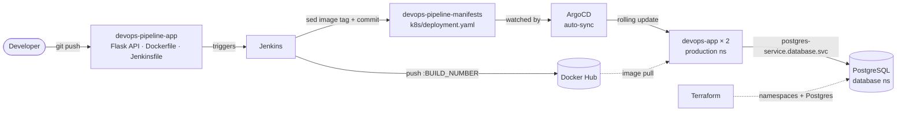

# DevOps Pipeline: Jenkins CI → ArgoCD GitOps


> A two-repo GitOps pipeline where **Jenkins never touches the cluster**. Jenkins builds the image, pushes a build-numbered tag to Docker Hub, and commits that tag to a manifests repo. ArgoCD syncs that repo into Kubernetes.

## 🎯 The Problem

When a CI server finishes with `kubectl apply`, the same three things tend to go wrong:

1. **CI holds cluster credentials.** The build server needs a kubeconfig that can write to production, so a compromised job means a compromised cluster.
2. **`:latest` hides what's running.** If every deploy reuses one tag, nobody can say which build is live, and a rollback has no earlier tag to go back to.
3. **Deploys leave no record in Git.** What's actually deployed shows up only in CI logs, where you can't diff or revert it.

This pipeline gives each job to a different system. Jenkins builds each image, tags it, and records the new tag as a Git commit. ArgoCD is the only component that changes the cluster, and it pulls those changes from Git.

## 🏗️ Architecture



*A `git push` to the app repo triggers a Jenkins job. It builds the Flask API with a multi-stage Dockerfile and pushes the image to Docker Hub twice, once as `:BUILD_NUMBER` and once as `:latest`. Jenkins then clones the manifests repo, uses `sed` to change the image tag in `k8s/deployment.yaml`, and commits the change as `Jenkins CI`. ArgoCD auto-syncs that repo, so it picks up the commit and rolls the `devops-app` Deployment in the `production` namespace over to the new tag. Those pods talk to PostgreSQL in the `database` namespace. Terraform created that database, along with the namespaces, before the pipeline first ran.*



**Flow:** push app code → Jenkins builds and pushes `:N` → Jenkins commits `image: …:N` to the manifests repo → ArgoCD syncs → the pods roll over to build N. At no point does the CI server run `kubectl`.

## 🔧 Implementation Highlights

- **Two-repo GitOps split.** Application source (`devops-pipeline-app`) and deployment state (`devops-pipeline-manifests`) live in separate repos, so an app commit and a deploy are separate events with separate histories. The manifests repo's log doubles as a record of deploys, with entries like `Update image to build 2` authored by `Jenkins CI`.
- **A Git commit as the handoff from CI to CD.** The Jenkinsfile's last stage clones the manifests repo using a `github-creds` token, rewrites the tag with `sed -i 's|image: ahmed3015/devops-pipeline-app:.*|…:${BUILD_NUMBER}|'`, and pushes. Jenkins needs Docker Hub and GitHub credentials but no kubeconfig. That's the security reason for going through Git instead of calling ArgoCD or `kubectl` directly.
- **Build-numbered image tags.** Every build pushes both `:${BUILD_NUMBER}` and `:latest`, but the manifest always pins the numbered tag. Rolling back means reverting one Jenkins commit, and the older image is still on Docker Hub to go back to.
- **Multi-stage, non-root image.** The builder stage runs `pip install --prefix=/install --no-cache-dir`. The runtime stage copies only `/install` into a fresh `python:3.11-slim`, so neither the pip cache nor the build layers end up in the final image. The app runs as a system `appuser` under Gunicorn with 2 workers instead of Flask's development server.
- **Database in its own namespace.** The app runs in `production` and PostgreSQL in `database`. The app reaches the database at the fully qualified `postgres-service.database.svc.cluster.local`, passed in as `DB_HOST`. Keeping the two in separate namespaces means each can get its own access controls and resource quotas later without changing the app manifest.
- **Terraform for the cluster baseline.** `terraform/main.tf` uses the `hashicorp/kubernetes` provider (`~> 3.0`) with the local kubeconfig. It creates the `production`, `database`, and `argocd` namespaces, plus the Postgres Deployment and its ClusterIP Service. Rebuilding the environment starts with a single `terraform apply` rather than a series of `kubectl create` commands.
- **Rolling updates with headroom.** With `replicas: 2`, `maxUnavailable: 1`, and `maxSurge: 1`, the old pods are replaced gradually instead of all at once.
- **A health endpoint that checks the database.** `/health` runs `SELECT 1` against Postgres and returns `500` if the query fails. It shows whether the app can reach its database, not just whether the process is up. It's designed as the target for readiness checks: a failing pod is removed from the Service's endpoints until the database is reachable again.

## 📊 Results & KPIs

| Metric | Outcome |
|---|---|
| Manual deploy steps after `git push` | **Zero.** Jenkins build #2 built the image, pushed it, and committed the new tag, and ArgoCD rolled it out |
| Time from manifest commit to running pods | **~2 minutes.** Jenkins' commit landed at 19:04:02, and both new pods were running by 19:06:10 |
| Rollout health | **2/2 pods `Running` 1/1, 0 restarts** in `production` |
| ArgoCD state | **`Synced` + `Healthy`** for both the Deployment and the Service |
| Cluster credentials held by CI | **None.** Jenkins has Docker Hub and GitHub credentials only, with no kubeconfig |
| Image traceability | **One tag per build.** The manifest pins `devops-pipeline-app:2`, not `:latest` |
| App ↔ database | **`{"database":"connected","status":"healthy"}`** from `/health` under Docker Compose. Terraform's Postgres pod is `Running` with 0 restarts |

## 📸 Proof

| ArgoCD synced, but not healthy yet | Build #2 rolled out by Jenkins + ArgoCD |
|---|---|
|  |  |

| ArgoCD reporting Synced + Healthy | Flask API reaching Postgres under Compose |
|---|---|
|  |  |

More screenshots, including the Terraform-provisioned Postgres pod in the `database` namespace, are in [`Screenshots/`](Screenshots).

### 🐛 What actually broke

- **"Synced" while every pod was failing.** The first manifest commit pointed at `ahmed3015/devops-pipeline-app:latest` before Jenkins had pushed any image. ArgoCD applied it without complaint and showed **Synced** to `6c083e8`, but app health stayed at **Progressing** and both pods were stuck in `ErrImagePull`. **Synced** only means the cluster matches Git. Whether the workload actually runs is what Health tells you. Re-syncing wouldn't have helped. The pipeline had to deliver a real image first.
- **Build #1 failed on a leftover template placeholder.** The Jenkinsfile was committed with `DOCKER_IMAGE = "[[DOCKERHUB_USERNAME=\"ahmed3015\"]]/devops-pipeline-app"`, a fill-in marker nobody had replaced. Docker rejects brackets in an image name, so the build failed before anything was pushed. Once it read `ahmed3015/devops-pipeline-app`, build #2 ran all the way through. That's why the first tag in the manifests repo is `:2`, not `:1`.

## 💻 Source Code

The code behind this write-up is split into two repos, matching the pipeline itself:

- **[kingswanzy2020/devops-pipeline-app](https://github.com/kingswanzy2020/devops-pipeline-app)** has the Flask + PostgreSQL API, the multi-stage `Dockerfile`, the `Jenkinsfile` that builds and pushes the image and updates the manifest, `docker-compose.yml` for local testing, and `terraform/main.tf` for the namespaces and Postgres.
- **[kingswanzy2020/devops-pipeline-manifests](https://github.com/kingswanzy2020/devops-pipeline-manifests)** has `k8s/deployment.yaml` and `k8s/service.yaml`. ArgoCD watches this repo, and Jenkins commits new image tags to it.

```bash
git clone https://github.com/kingswanzy2020/devops-pipeline-app.git
git clone https://github.com/kingswanzy2020/devops-pipeline-manifests.git
```

## 🧰 Skills Demonstrated

`Jenkins` · `ArgoCD` · `GitOps` · `Kubernetes` · `Terraform` · `Docker multi-stage builds` · `Docker Hub` · `Flask` · `PostgreSQL` · `Gunicorn` · `Rolling updates` · `Cross-namespace service discovery` · `Build-numbered image tags`

---

<sub>Built by **Ahmed Tetteh** ([kingsleyswanzy@gmail.com](mailto:kingsleyswanzy@gmail.com)) as part of a [NextWork](https://nextwork.ai/projects/72c17baa-3fe5-467c-9bad-ede78551561a) track. [Certificate](certificate.pdf). About 2 hours of hands-on build, most of it spent getting the Jenkins stage working.</sub>
