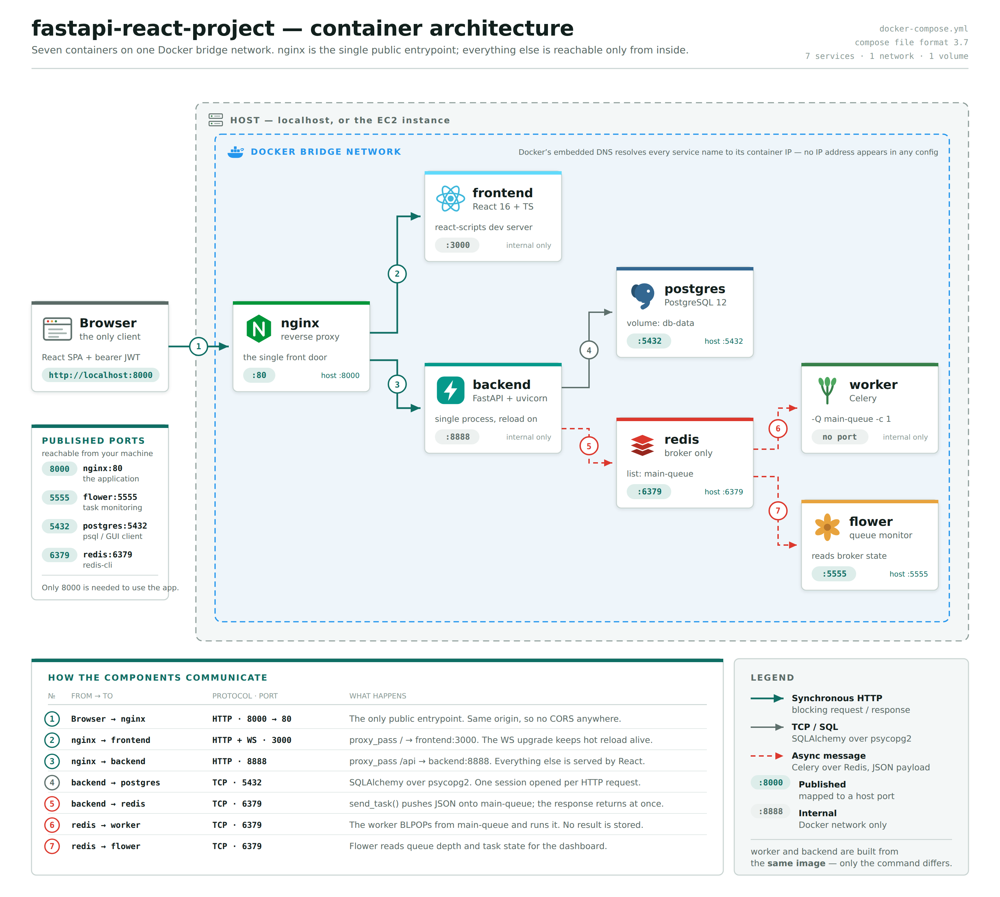
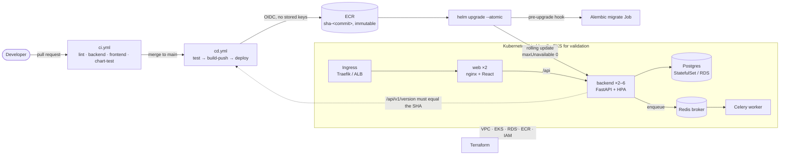

# FastAPI + React: Template to Production on Kubernetes


> An open-source FastAPI + React + Postgres + Celery starter that only ran under `docker-compose up`, taken to production in eight stages: containerized, provisioned with Terraform, configured with Ansible, moved to Kubernetes with Helm, and shipped by GitHub Actions. Every image is named after its commit, and **a release that fails never takes traffic**: I broke it on purpose at every stage (stopped containers, deleted pods, a drained node, a missing image) and recorded what each failure looked like.

## 🎯 The Problem

The application code was not mine to write, and it was fine. What it lacked was everything between a laptop and a running service:

1. **Secrets in source.** `SECRET_KEY` was a string literal in Python, so anyone with the repo could forge an admin token.
2. **One compose file for dev and prod.** The frontend ran a webpack dev server, Postgres and Redis were published on the host, and startup order depended on a `sleep`.
3. **No infrastructure, and no way to rebuild it.** Nothing described the network, the database, the registry, or the server.
4. **A server configured once, by a boot script.** `user_data` runs a single time, so the box drifts from the script the day after it boots.
5. **No answer to "which commit is running?"** Images were tagged `latest`, which makes a rollback a guess.
6. **Failed deploys reach users.** Nothing separated "the deploy command exited 0" from "the new version is serving".

The project fixes these in two passes. The first containerizes the app for production and runs it on a single EC2 host, built by Terraform and converged by Ansible. The second moves it to Kubernetes: one Helm chart on a three-node local kind cluster, failure drills, CI/CD, and immutable image versioning, with EKS at the end as a same-day run for what a laptop cannot show (ALB ingress, IRSA, RDS, OIDC from GitHub).

## 🏗️ Architecture



*A pull request runs four CI jobs with no cloud credentials, one of which installs the Helm chart on a throwaway kind cluster inside the runner and forces a bad upgrade to prove it rolls itself back. A merge to `main` re-runs those checks, then builds each image once, tags it `sha-<40-character commit>`, and pushes it to an immutable ECR repository using a short-lived OIDC token. `helm upgrade --atomic` runs the Alembic migration as a hook before any pod changes, then rolls the backend with `maxUnavailable: 0`. The pipeline's last step asks the running app for `/api/v1/version` and fails unless it returns the commit that was just built. Inside the cluster, the ingress (Traefik on kind, an ALB on EKS) sends everything to `web`, an nginx container that serves the React bundle and proxies `/api` to the backend. The backend reads Postgres and enqueues Celery tasks on Redis for the worker. Terraform provisions the VPC, EKS, RDS, ECR, and the IAM roles the pipeline and the in-cluster controllers assume.*

The application itself, as it runs under Docker Compose and on the EC2 host:





**Flow:** PR → 4 CI jobs (including a Helm install and forced rollback on kind) → merge → build once, tag by commit SHA → ECR over OIDC → `helm upgrade --atomic` → migration hook → rolling update → smoke test confirms the serving SHA.

## 🔧 Implementation Highlights

- **nginx as the single origin**: one container serves the React bundle and proxies `/api`, so the frontend calls a relative `/api/v1` and CORS is never configured. This is the decision everything else leans on: the same image works behind `localhost:8000`, an Elastic IP, Traefik, and an ALB without a rebuild.
- **Layered compose files and multi-stage images**: a base file plus a dev override and a prod file, instead of one file with conditionals. The production frontend is a static build behind nginx with no Node runtime, and the backend runs gunicorn with uvicorn workers as a non-root user.
- **Terraform environments as directories, not workspaces**: `dev`, `prod`, and `dev-k8s` differ in structure (NAT or not, EC2 or EKS), not only in values, and each gets its own state key in S3 with native lockfile locking. Secrets Manager holds the app secret and the RDS master password. Terraform creates the secret container and never the value, so neither enters state.
- **Ansible instead of a longer boot script**: the `common`, `docker`, and `app` roles are re-runnable, where `user_data` is not. A dynamic `aws_ec2` inventory finds the instance by the tags Terraform set, so no IP address is committed. Secrets are read on the instance with its own IAM role and written straight into a `0640` `.env` under `no_log`.
- **Local kind first, EKS last**: every behavioural test (probes, PDBs, drains, HPA, rollbacks) is free on a laptop. EKS costs about $0.30–0.35 an hour with NAT, an ALB, nodes, and RDS, so it runs for one session to check the AWS-only pieces and is destroyed the same day. The chart is identical in both. Only `values-local.yaml` and `values-eks.yaml` differ.
- **Readiness checks dependencies, liveness checks nothing**: `/health/ready` runs `SELECT 1` and opens a broker connection, and a failing pod leaves the Service endpoints. `/health/live` touches nothing external, so a database blip takes pods out of rotation instead of restarting all of them at once.
- **Migrations as a Helm hook, not an initContainer**: an initContainer would run `alembic upgrade head` once per replica, concurrently. A `post-install,pre-upgrade` Job runs once per release, and if it fails the release fails before any Deployment is touched.
- **The full git SHA is the only deployable tag**: ECR repositories are `IMMUTABLE`, so a re-push fails at the registry and not by convention. The SHA is baked into the image as a build arg and an OCI label and served at `/api/v1/version`, which makes `imagePullPolicy: IfNotPresent` safe and gives rollback a target that still exists.
- **OIDC with one role per trust subject**: `github-push` trusts `ref:refs/heads/main` and can only write to ECR. `github-deploy` trusts `environment:dev` and maps, through an EKS access entry, to a Kubernetes Role in the `fastapi-react` namespace alone. No AWS access keys are stored in the repository.
- **CI gates that are honest about inherited debt**: eslint runs only on files a PR changes, because the template arrives with 59 existing airbnb errors. Trivy reports to the job summary instead of failing the build, because the backend image carries 90 fixable HIGH/CRITICAL findings from end-of-life Python 3.8. A gate that is red on day one gets ignored, and both are one flag away from enforcing.

## 📊 Results & KPIs

| Metric | Outcome |
|---|---|
| Infrastructure from one plan | **34 resources** added by `terraform apply`; a second apply reports **No changes** |
| Chart validity, offline | **17 / 13 / 16 objects** rendered for local, CI, and EKS values, **0 invalid** under kubeconform |
| PR feedback | **4 CI jobs green in about 4 minutes**, with no cloud credentials on the runner |
| Rollback proven on every PR | `chart-test` forces a bad upgrade on kind and Helm returns to revision 1 on its own, in a **4m 5s** job |
| Merge to running on EKS | CD run **7m 48s** end to end: test → build-push → **26s deploy**. In a later session the ALB answered `/api/v1/version` with commit `0d6e7d7…` |
| Pod loss | Both backend pods deleted; replacements **1/1 Running in 15 seconds** |
| Dependency loss | Redis scaled to 0: both backend pods **0/1 Ready with 0 restarts**, out of rotation and not crash-looping |
| Load | HPA scaled the backend **2 → 6 replicas in about a minute** under `hey -c 50`, then back to 2 roughly 5 minutes after the load stopped |
| Failed release blast radius | New `web` pod stuck in `ImagePullBackOff` while the old ReplicaSet stayed **2/2 Ready**. Users saw nothing |
| Traceability | After 28 Helm revisions, `/api/v1/version` returned `9a37ec05…`, **equal to `git rev-parse HEAD`** |

## 📸 Proof

**Stage 3–4: Terraform and Ansible on EC2**

| Second apply: infrastructure matches the configuration | systemd unit that brings the stack back after a reboot |
|---|---|
|  |  |

| Celery task queued through nginx on the Elastic IP | Injected failure: backend stopped, nginx answers 502 |
|---|---|
|  |  |

**Stage 5: Kubernetes on a three-node kind cluster**

| Chart renders and validates for all three environments | Backend replicas spread across both workers, migration Job completed |
|---|---|
|  |  |

| Redis down: backend leaves rotation, 0 restarts | HPA under load: 2 → 6 replicas and back |
|---|---|
|  |  |

| Draining a worker: pods reschedule, Postgres stays `Pending` on its node-pinned volume |
|---|
|  |

**Stage 6: CI/CD with GitHub Actions**

| Four checks on the pull request | `chart-test`: a bad upgrade rolls itself back inside the runner |
|---|---|
|  |  |

| CD run: test → build-push → deploy to EKS | The app served through the ALB |
|---|---|
|  |  |

**Stage 7–8: versioning and the final operational test**

| The EKS deployment reporting its own commit | Detect: the new `web` pod cannot pull, old pods still serving |
|---|---|
|  |  |

| Roll back: revision history with the failed releases kept | Verify: serving SHA equals `git rev-parse HEAD` |
|---|---|
|  |  |

More screenshots in [`Screenshots/`](Screenshots).

### What actually broke

- **OIDC role assumption failed 12 times out of 12.** The first CD run with EKS enabled died in `configure-aws-credentials` with `Not authorized to perform sts:AssumeRoleWithWebIdentity`. The trust policy matched on `repo:<owner>/<repo>`, but this repository issues immutable subjects that include the numeric owner and repository IDs (`repo:<owner>@<id>/<repo>@<id>`). I changed the trusted prefix to that form and the next run pushed and deployed.

  

- **The RDS password corrupted the `.env` file.** The generated master password contained a `$`, which the deploy script expanded as a variable. The migrate container exited 1 and the deploy stopped there. The fix was to pass the value so the `$` stays literal.
- **A healthy container reported unhealthy.** The frontend `HEALTHCHECK` probed `http://localhost/`, which resolves to `::1` first, and the custom `nginx.conf` listens on IPv4 only. `wget` was refused and never fell back, while real traffic worked. Pointing the probe at `127.0.0.1` fixed it.
- **The first Ansible dry run failed.** `--check --diff` reported `failed=1` on a fresh host, because it simulated a `chown` to a `deploy` user that the same dry run had only pretended to create. Check mode is for hosts that have been converged at least once.
- **The second converge reported `changed=1`, not 0.** With the tag left on `latest` and `pull: always`, every run re-pulls. That stops once a fixed SHA is passed (`-e app_image_tag=<sha>`), which is one more argument for never deploying `latest`.
- **ansible-lint and black could not share an environment.** `ansible-lint 26.9.0` needs `black>=25.2.0` and the workflow pins `black==24.2.0`. The lint job now installs ansible-lint into its own virtualenv under `$RUNNER_TEMP`.
- **RDS would not create in the chosen subnets.** In this account `db.t4g.micro` was offered only in `us-east-1c` and `1f`, and the subnets are in `1a` and `1b`. Switched the EKS environment to `db.t3.micro`.
- **A rollback test that did not go to plan.** For the final test I tagged only the backend image as `sha-deadbeef`, so the release asked for a frontend tag that did not exist and `web` went into `ImagePullBackOff`. That turned out to be the better drill: revision 25 was marked failed, the old ReplicaSet kept both `web` pods Ready, and `helm rollback` returned the release to a known-good revision.

## 💻 Source Code

The code behind this write-up — the multi-stage `Dockerfile`s and layered compose files, the Terraform modules (`network`, `ecr`, `database`, `compute`, `eks`) with one directory per environment, the Ansible roles and dynamic inventory, the `deploy/helm/fastapi-react` chart with its `values-local.yaml` / `values-ci.yaml` / `values-eks.yaml`, the `scripts/k8s/` helpers, and the `ci.yml` and `cd.yml` workflows — lives at **[kingswanzy2020/sample-fastapi-react](https://github.com/kingswanzy2020/sample-fastapi-react)**.

```bash
git clone https://github.com/kingswanzy2020/sample-fastapi-react.git
```

## 🧰 Skills Demonstrated

`Kubernetes` · `Helm charts & hooks` · `kind` · `Amazon EKS` · `AWS Load Balancer Controller` · `IRSA` · `External Secrets` · `Terraform modules & remote state` · `Ansible roles & dynamic inventory` · `GitHub Actions` · `OIDC federation` · `Amazon ECR` · `Immutable image tagging` · `Docker multi-stage builds` · `Docker Compose` · `Liveness/readiness probes` · `HPA` · `PodDisruptionBudgets` · `Rolling updates & rollback` · `Trivy` · `Failure injection` · `NGINX reverse proxy` · `FastAPI` · `Celery` · `PostgreSQL / RDS`

---

<sub>Built by **Ahmed Tetteh** ([kingsleyswanzy@gmail.com](mailto:kingsleyswanzy@gmail.com)) as a self-directed project on top of an open-source FastAPI + React starter template. Eight stages between August and October 2026, with the EKS environment provisioned, validated, and destroyed in single-day sessions.</sub>
