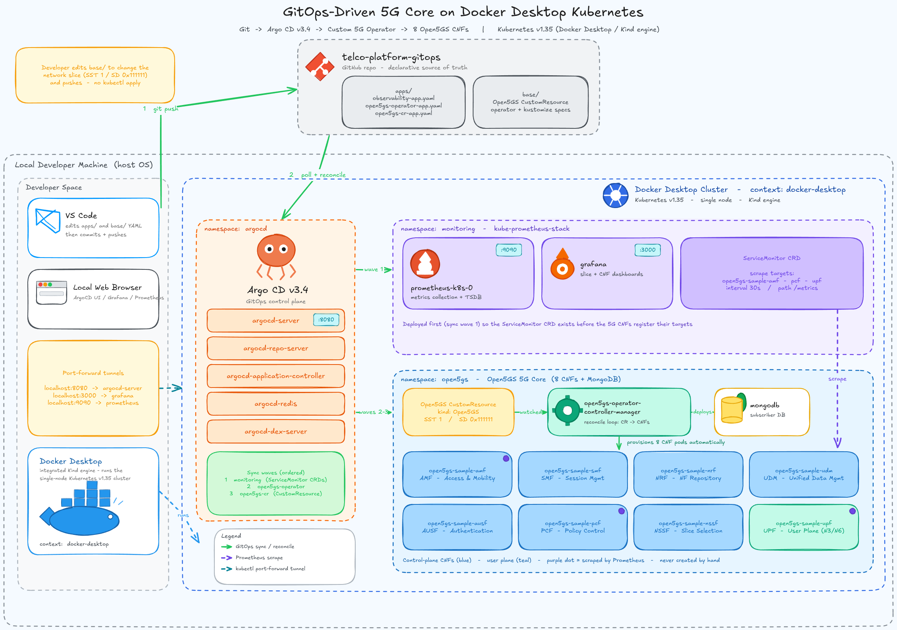
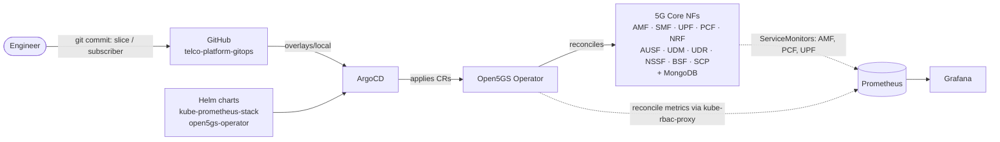

# GitOps-Driven 5G Core on Kubernetes


> A 5G Standalone core (Open5GS) run as cloud-native network functions, where **adding a network slice is a one-line Git commit**. ArgoCD applies the change, and the Open5GS Operator turns it into running network functions.

## 🎯 The Problem

Telco cores have usually been configured by hand, box by box. On Kubernetes that habit turns into three failures:

1. **Slice and subscriber changes happen in the dark.** Someone edits a config on a live network function, and nobody can tell afterwards what changed or why.
2. **The desired state is spread across tools.** Helm releases, custom resources, and monitoring config are installed separately, so nothing records what the whole core is meant to look like.
3. **"Pods are running" says little about the core itself.** Without per-function metrics and operator metrics, you can't tell whether a change was actually reconciled.

This project fixes all three. One Git repo describes the whole core: the operator, the `Open5GS` custom resource with its slices, subscribers, and the observability wiring. ArgoCD syncs that repo to the cluster, the Operator reconciles the custom resources into network functions, and Prometheus scrapes both the network functions and the Operator.

## 🏗️ Architecture



*A slice or subscriber change starts as a commit to `telco-platform-gitops`. ArgoCD watches three Applications. Two are Helm charts (kube-prometheus-stack and the Open5GS Operator), and one is the `overlays/local` Kustomize overlay holding the `Open5GS` and `Open5GSUser` custom resources. When the overlay syncs, the Operator reconciles the custom resource into 11 network functions plus MongoDB, and rewrites only the config a change touches. Prometheus scrapes the AMF, PCF, and UPF through operator-generated ServiceMonitors. It also scrapes the Operator's own controller-runtime metrics through kube-rbac-proxy, and Grafana shows both.*



<sub>The original design, drawn before the build. The finished core gained a second slice (`SST 2`), a subscriber CR, and Operator metrics. It also runs 11 network functions rather than the 8 planned, because the Operator enables BSF, SCP, and UDR by default (see below).</sub>



**Flow:** commit → ArgoCD sync of `overlays/local` → Operator reconciles the `Open5GS` CR → network functions roll → Prometheus scrapes the functions and the Operator → Grafana.

## 🔧 Implementation Highlights

- **Three ArgoCD Applications, synced in dependency order.** `observability` (kube-prometheus-stack), `open5gs-operator` (Gradiant chart `1.0.7`), and `open5gs-cr` (this repo's `overlays/local`) are synced separately. The observability stack went in first because the Operator can only create `ServiceMonitor` objects once that CRD exists.
- **The Operator pattern instead of raw manifests.** The core is one `Open5GS` custom resource: PLMN `999/70`, TAC `0001`, and a list of slices. The Operator turns it into the individual network-function Deployments and ConfigMaps. A slice change is a two-line diff to the custom resource, not hand-edited NF configs.
- **Eleven network functions, not seven.** The track focuses on the seven headline 5G SA functions (AMF, SMF, UPF, NRF, UDM, AUSF, PCF), which is where the first count of 7 + MongoDB came from. The Operator also enables four supporting functions by default: **NSSF** (slice selection), **BSF** (binding support), **SCP** (service proxy), and **UDR** (data repository behind the UDM). With MongoDB that's 12 pods. Only the WebUI is off by default. The four extras were running before the second slice existed: ArgoCD shows the BSF ConfigMap two hours old right after the slice sync.
- **Network slicing through Git.** Commit `5907f0e` added a URLLC-style slice (`SST 2`, `SD 0x222222`) next to the existing `SST 1 / SD 0x111111`. ArgoCD reported *Sync OK* to that commit at 02:22:01, two minutes after it was made. A slice adds **no pods**. The Operator writes the slice list into just two ConfigMaps, the AMF's `s_nssai` and the NSSF's `nsi`, so the change lands as new config on those two functions.
- **Subscribers as custom resources.** An `Open5GSUser` CR (IMSI `999700000000001` on the test PLMN) is assigned to the new SST 2 slice and lives in its own Kustomize base. Provisioning a SIM becomes a reviewed commit instead of a click in the Open5GS WebUI.
- **Scoped ServiceMonitors.** Metrics are enabled only on the **AMF, PCF, and UPF**, the functions that hold registration, policy, and data-plane state. That covers the signals worth acting on without scraping every control-plane function.
- **Scraping the Operator itself.** A separate `open5gs-operator-metrics` base adds a `ServiceMonitor` for the controller-manager and a `ClusterRoleBinding` that lets Prometheus's ServiceAccount pass kube-rbac-proxy's `SubjectAccessReview`. With `controller_runtime_reconcile_total` available, reconciliation is measured directly rather than guessed from pod restarts.
- **Kustomize base/overlay layout.** Each concern (`open5gs-cr`, `open5gs-subscribers`, `open5gs-operator-metrics`) is its own base, and `overlays/local` composes them and labels everything `environment: local`. Adding a second cluster means adding an overlay, not copying manifests.

## 📊 Results & KPIs

| Metric | Outcome |
|---|---|
| ArgoCD Applications | **3 / 3 Healthy + Synced** (`observability`, `open5gs-cr`, `open5gs-operator`) |
| 5G core footprint | **11 network functions + MongoDB**, all reconciled from **one** `Open5GS` custom resource |
| Slice change, commit → synced | **~2 minutes** (`5907f0e` committed 02:20, *Sync OK* at 02:22:01) |
| Network slices | **2** (`SST 1 / SD 0x111111`, `SST 2 / SD 0x222222`), both declared in Git |
| Prometheus NF targets | **AMF, PCF, UPF all `UP`**, scrape duration **1 ms** each |
| Operator observability | Reconcile rate visible at **~0.1/s** (`controller="open5gs"`), starting minutes after the metrics commit landed |
| Manual `kubectl apply` for core config | **None.** Every change to the core in this build is a commit in the repo's history |

## 📸 Proof

| All three ArgoCD Applications Healthy + Synced | Slice change synced to commit `5907f0e` |
|---|---|
|  |  |

| Prometheus scraping the network functions | Grafana: NF resources + Operator reconciliation |
|---|---|
|  |  |

The AMF and UPF session panels read **0** because no gNB or UE simulator was attached, so no devices registered. The panels prove the metric pipeline works, not traffic. More screenshots, including the repo layout before and after restructuring, are in [`Screenshots/`](Screenshots).

### 🐛 What actually broke

- **`ImagePullBackOff` on the Operator.** Chart `1.0.5` pulled `kube-rbac-proxy` from `gcr.io/kubebuilder`, a registry path that has been retired. The first fix overrode the image to `quay.io/brancz/kube-rbac-proxy:v0.18.1` in the Application's Helm values. Moving to chart `1.0.7` made the override unnecessary, and it was removed.
- **Permanently OutOfSync while every pod was healthy.** The custom resource set `serviceMonitor: true` at the top of `spec`. The CRD has no such field (it's per network function), so the API server's structural-schema pruning silently dropped it on every apply. Git always had a field the live object never kept, so ArgoCD kept reporting drift. Moving the flag under `amf:`, `pcf:`, and `upf:` fixed the drift and turned on the scrape targets.
- **The Application pointed at a placeholder repo.** The first `open5gs-cr` Application still had `YOURUSER/telco-gitops.git` and targeted `base/` directly, while `overlays/local` listed raw YAML files instead of Kustomize bases. The restructure (`3b06c11`) pointed it at the real repo and `overlays/local`, and turned each base into a proper Kustomization.

## 💻 Source Code

The code behind this write-up — the three ArgoCD `Application` manifests in `apps/`, the `Open5GS` custom resource with both network slices, the `Open5GSUser` subscriber, the Operator-metrics `ServiceMonitor` + `ClusterRoleBinding`, and the `overlays/local` Kustomization that ties them together — lives at **[kingswanzy2020/telco-platform-gitops](https://github.com/kingswanzy2020/telco-platform-gitops)**.

```bash
git clone https://github.com/kingswanzy2020/telco-platform-gitops.git
```

## 🧰 Skills Demonstrated

`GitOps` · `ArgoCD` · `Kubernetes` · `Kubernetes Operators` · `Custom Resources` · `Open5GS` · `5G Standalone Core` · `Network Slicing` · `Cloud-Native Network Functions` · `Kustomize` · `Helm` · `Prometheus` · `ServiceMonitors` · `kube-rbac-proxy` · `Grafana` · `CRD schema debugging`

---

<sub>Built by **Ahmed Tetteh** ([kingsleyswanzy@gmail.com](mailto:kingsleyswanzy@gmail.com)) as part of a [NextWork](https://nextwork.ai/projects/799fb960-401e-46b3-9f9b-2870cb9c0d45) track, then extended with subscriber CRs, Operator metrics, and a Grafana dashboard. [Certificate](certificate.pdf). About 3 hours for the core build, most of it spent chasing the OutOfSync status, plus the extensions afterwards.</sub>
