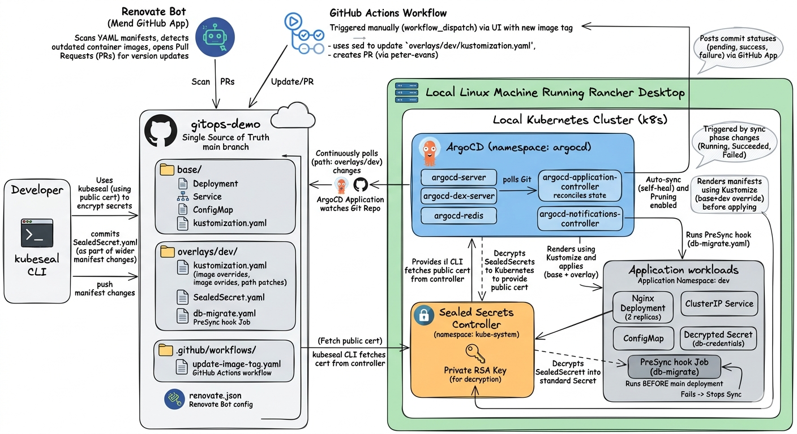
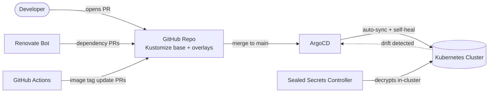

# GitOps Deployment Pipeline with ArgoCD


> A production-grade GitOps pipeline where **every cluster change flows through a pull request** — ArgoCD keeps the cluster in lockstep with Git, reverts manual drift automatically, and secrets live *encrypted* in the repo.

## 🎯 The Problem

Teams that manage Kubernetes with ad-hoc `kubectl apply` face three chronic failures:

1. **No audit trail** — nobody knows who changed what, when, or why.
2. **Configuration drift** — the cluster silently diverges from the manifests in Git until something breaks.
3. **Secrets can't live in Git** — so they're managed out-of-band, undocumented, and unreproducible.

This project eliminates all three by making Git the **single source of truth** and ArgoCD the enforcement engine.

## 🏗️ Architecture



*Every change — developer PRs, Renovate dependency bumps, and GitHub Actions image-tag updates — merges into the GitHub repo as the single source of truth. ArgoCD auto-syncs the Kubernetes cluster to match Git and self-heals any manual drift, while Sealed Secrets are decrypted only in-cluster so credentials stay encrypted in the repo.*





**Flow:** every change — app manifests, image tags, dependency bumps — lands as a PR. On merge, ArgoCD syncs the cluster to match Git. Manual changes to the cluster are detected as drift and reverted automatically.

## 🔧 Implementation Highlights

- **ArgoCD with auto-sync + self-heal** — deployed in-cluster, registered against the GitHub repo as the single source of truth. When I manually scaled a deployment to test it, ArgoCD detected the drift and terminated the rogue pod within seconds, restoring the Git-declared state.
- **Kustomize base/overlay structure** — a shared `base/` with per-environment overlays, so dev and prod diverge only where they must. `kustomization.yaml` is ArgoCD's entry point for each environment.
- **Sealed Secrets for credentials in Git** — secrets are encrypted with `kubeseal` before commit; only the in-cluster controller holds the private key to decrypt them. Zero plaintext secrets in the repo.
- **PR-based image updates via GitHub Actions** — a workflow bumps image tags through pull requests, so every deploy carries a diff, author, timestamp, and approval history.
- **Renovate Bot** — automatically opens PRs when base images or dependencies release updates (with `fileMatch` configured so the Kubernetes manager picks up the manifests).
- **PreSync hooks** — validation jobs run before each sync; if the hook fails, the entire sync aborts, keeping bad changes out of the cluster.

## 📊 Results & KPIs

| Metric | Outcome |
|---|---|
| Cluster changes with full audit trail | **100%** — every change is a reviewable PR (diff, author, approval) |
| Drift correction | **Automatic, in seconds** — self-heal reverted manual scaling without intervention |
| Plaintext secrets in Git | **Zero** — all credentials committed as SealedSecrets |
| Rollback procedure | **`git revert` + auto-sync** — no manual kubectl surgery |
| Dependency updates | **Automated PRs** via Renovate Bot — no stale base images |
| Unsafe syncs blocked | **PreSync hooks** abort the sync on validation failure |

## 📸 Proof

| Self-healing reverting manual drift | Sealed Secret committed to Git |
|---|---|
|  |  |

More screenshots in [`Screenshots/`](Screenshots).

## 💻 Source Code

The code behind this write-up — the Kustomize base and dev overlay ArgoCD syncs from, the `Application` manifest with `selfHeal` and `prune` enabled, and the SealedSecret — lives at **[kingswanzy2020/gitops-demo](https://github.com/kingswanzy2020/gitops-demo)**.

```bash
git clone https://github.com/kingswanzy2020/gitops-demo.git
```

## 🧰 Skills Demonstrated

`ArgoCD` · `GitOps` · `Kubernetes` · `Kustomize` · `Sealed Secrets` · `GitHub Actions` · `Renovate Bot` · `TLS/cert handling` · `PR-driven change management`

---

<sub>Built by **Ahmed Tetteh** ([kingsleyswanzy@gmail.com](mailto:kingsleyswanzy@gmail.com)) as part of a [NextWork](https://learn.nextwork.org/projects/f94cbac9-2de1-4ed1-a871-70cdb298bcf6) track, then extended — [certificate](certificate.pdf). ~7 hours of hands-on build and troubleshooting.</sub>
