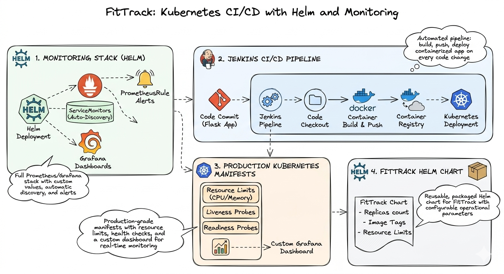
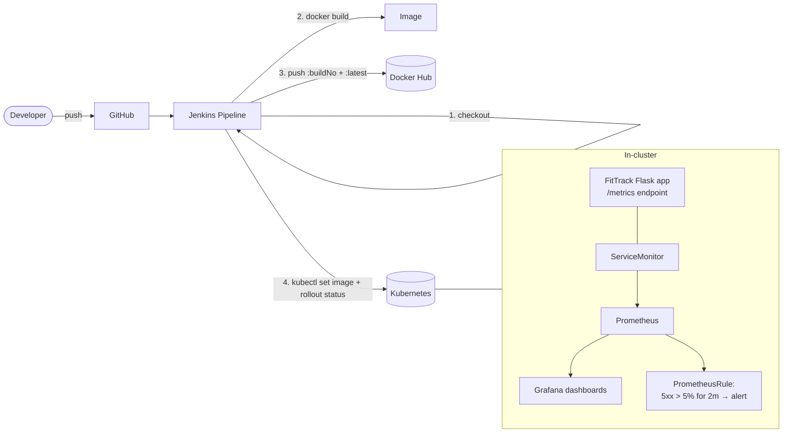

# Kubernetes CI/CD with Helm & Full-Stack Monitoring

> A complete production-style stack: a Flask app (**FitTrack**) shipped to Kubernetes by a Jenkins pipeline on every commit, packaged as a reusable Helm chart, and watched by Prometheus/Grafana with alert rules that fire **before users complain**.

## 🎯 The Problem

Two failure modes kill teams running Kubernetes without this setup:

1. **Unrepeatable releases** — raw YAML manifests copy-pasted between environments mean no versioning, no rollback, and "works in dev" surprises in prod.
2. **Invisible failures** — without metrics and alerting, the first monitoring system is your users.

This project solves both: Helm makes releases versioned and reversible; Prometheus/Grafana make failures visible and alertable.

## 🏗️ Architecture

## 🔧 Implementation Highlights

- **kube-prometheus-stack via Helm** with custom `monitoring-values.yaml` — including cross-namespace ServiceMonitor discovery so Prometheus finds targets beyond its own namespace.
- **Instrumented Flask app** — FitTrack exposes a `/metrics` endpoint (request counts per route) that Prometheus scrapes automatically through a `ServiceMonitor`.
- **Production deployment patterns** — resource limits, plus distinct **liveness** (restart dead containers) and **readiness** (pull unready pods out of the Service) probes.
- **Four-stage Jenkins pipeline** — checkout → Docker build → push (build-number *and* `latest` tags) → `kubectl set image` with `rollout status` verification, so a failed rollout fails the build.
- **Noise-resistant alerting** — a `PrometheusRule` fires only when >5% of requests return 5xx for 2 continuous minutes, filtering one-off blips from real incidents.
- **Reusable Helm chart** — FitTrack packaged with templated values (replicas, image tag, resources) overridable per environment via `--set` / values files.

The application code, Helm chart, and Jenkinsfile live at [kingswanzy2020/fittrack](https://github.com/kingswanzy2020/fittrack).

## 📊 Results & KPIs

| Metric | Outcome |
|---|---|
| Release process | **One command**, versioned — rollback is `helm rollback`, not YAML archaeology |
| Deploy on code change | **Fully automated** — push to GitHub → live in the cluster, rollout-verified |
| Time-to-detect failures | From *"user reports it"* to **alert within 2 minutes** of sustained 5xx errors |
| False-alert noise | Suppressed by design — 2-minute sustained threshold before firing |
| Environment reuse | Same chart deploys dev/prod with values overrides only |
| Failed rollouts reaching users | Blocked — pipeline fails if `rollout status` doesn't converge |

## 📸 Proof

| Grafana dashboard on live app metrics | Alert rule firing on error threshold |
|---|---|
|  |  |

More screenshots in [`Screenshots/`](Screenshots).

## 🧰 Skills Demonstrated

`Kubernetes` · `Helm charts & templating` · `Prometheus` · `Grafana` · `PrometheusRules / alerting` · `ServiceMonitors` · `Jenkins` · `Docker` · `Flask instrumentation` · `Liveness/readiness probes`

---

Built by **Ahmed Tetteh** ([kingsleyswanzy@gmail.com](mailto:kingsleyswanzy@gmail.com)) as part of a [NextWork](https://learn.nextwork.org/projects/15afd2e5-d464-4cb6-89bc-947b6d20187f) track, then extended — [certificate](certificate.pdf). ~8 hours including troubleshooting Jenkins↔kubectl integration.
