# Launch a Kubernetes Cluster on Amazon EKS

> A production-managed Kubernetes control plane on Amazon EKS, provisioned with `eksctl`, with IAM-to-RBAC access mapping and **self-healing worker nodes proven by deleting them**.

## 🎯 The Problem

Bootstrapping Kubernetes by hand means assembling a control plane, networking, and worker nodes yourself — days of work and a large operational risk surface. Managed EKS reduces that to minutes, but you still need to get provisioning, networking, and the IAM↔Kubernetes permission boundary right.

## 🏗️ Architecture

*One declarative `eksctl create` command drives CloudFormation stacks that provision the EKS control plane, VPC, and worker node group. IAM access entries map into Kubernetes RBAC, and the node group self-heals: delete a worker and a replacement is launched automatically to restore the desired count.*

## 🔧 What I Built

- **An EKS cluster via `eksctl`** — one declarative command specifying cluster name, region, Kubernetes version, and node group; eksctl drives **CloudFormation stacks** that provision the control plane, VPC networking, and the node group (worker EC2 instances).
- **IAM access entries** — mapped my IAM user into Kubernetes RBAC with `AmazonEKSClusterAdminPolicy`, bridging AWS identity and Kubernetes' own permission model to unlock the EKS console node view.
- **Self-healing verification** — I deleted the node-group EC2 instances directly; Kubernetes noticed the gap against the desired node count and **provisioned replacements automatically**.
- **Real troubleshooting** — resolved missing-tool and missing-IAM-permission failures on the admin instance before the cluster would create.

## 📊 Results

| Metric | Outcome |
|---|---|
| Cluster provisioning | **~1 hour** from zero (vs. days for a manual control plane) |
| Node failure recovery | **Automatic** — terminated nodes replaced with no intervention |
| Access control | IAM identities mapped to Kubernetes RBAC — no shared credentials |
| Infrastructure visibility | Every resource traceable through its CloudFormation stack |

## 🧰 Skills Demonstrated

`Amazon EKS` · `eksctl` · `CloudFormation` · `Kubernetes node groups` · `IAM access entries / RBAC` · `EC2`

---

Built by **Ahmed Tetteh** as part of a [NextWork](http://learn.nextwork.org/projects/aws-compute-eks1) track. Part 1 of the Kubernetes series — continued in [kubernetes-deployment](../kubernetes-deployment).
