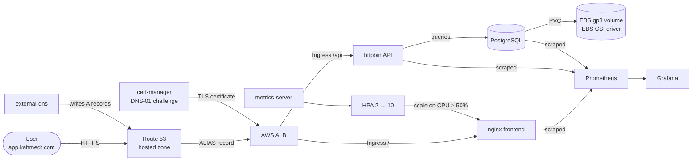

# Production App on Amazon EKS


> A three-tier application running on a real EKS cluster at a real domain — **DNS, TLS, storage, scaling, and observability all provisioned by the cluster itself**, with nothing clicked in the console after `eksctl create cluster`.

## 🎯 The Problem

"It runs on Kubernetes" is not the same as "it runs in production." A cluster that only serves `kubectl port-forward` is missing everything that makes a deployment real:

1. **No front door** — no public DNS, no certificate, no load balancer. Users can't reach it, and if they could, it wouldn't be over HTTPS.
2. **Nothing survives a restart** — a database pod without a persistent volume loses its data the moment it's rescheduled.
3. **No elasticity, no visibility** — fixed replica counts buckle under traffic spikes, and with no metrics you find out from the users.
4. **Wide-open permissions** — pods with node-level IAM credentials and cluster-admin service accounts turn one compromised container into a full account breach.

This project closes all four gaps on a 2-node EKS cluster: a public HTTPS endpoint with an auto-renewing certificate, EBS-backed persistence, CPU-driven autoscaling, a full Prometheus/Grafana stack, and least-privilege access via IRSA and RBAC.

## 🏗️ Architecture



*A browser hits `https://app.kahmedt.com`. Route 53 — authoritative for the domain after delegation from Porkbun, with records written automatically by external-dns — resolves it to an ALB that the AWS Load Balancer Controller provisioned from an Ingress resource, terminating TLS with a certificate cert-manager obtained via a DNS-01 challenge. The Ingress routes `/` to the nginx frontend and `/api` to the httpbin API, which queries a PostgreSQL data tier backed by an EBS volume through the CSI driver. metrics-server feeds the HPA, which scales the frontend out when CPU crosses 50% of its request, while kube-prometheus-stack scrapes the whole cluster into Grafana dashboards.*



**Flow:** every piece of the front door — DNS record, TLS certificate, load balancer — is created by a controller reacting to a Kubernetes resource, not by a human in the AWS console. The same is true of storage and scale: a PVC provisions an EBS volume on demand, and the HPA adds replicas on measured CPU.

## 🔧 Implementation Highlights

- **2-node EKS cluster via eksctl, with an OIDC provider** — the OIDC provider is the foundation for everything that follows: it lets specific Kubernetes service accounts assume specific IAM roles (IRSA), so no controller ever borrows the node's instance profile.
- **AWS Load Balancer Controller with IRSA** — the controller watches Ingress resources and provisions a real ALB, holding an IAM role bound to exactly one service account. Path-based routing sends `/` to the frontend and `/api` to the httpbin API through a single load balancer.
- **Route 53 as the authoritative DNS source** — the domain was delegated from Porkbun to a Route 53 hosted zone so that AWS became the single source of truth for records. That authority is what makes DNS-01 certificate validation and external-dns automation possible at all.
- **cert-manager with the DNS-01 challenge** — chosen over HTTP-01 deliberately: DNS-01 validates before the domain resolves to the cluster, which sidesteps the chicken-and-egg problem of needing a working ALB to prove you own a domain that the ALB is supposed to serve. It also leaves the door open to wildcard certificates.
- **EBS CSI driver with `WaitForFirstConsumer`** — the volume isn't provisioned until a pod actually claims it *and* has been scheduled, so the EBS volume is always created in the same Availability Zone as the node that needs it, instead of stranding a volume in the wrong AZ.
- **RBAC and namespace isolation** — the application runs in its own `app` namespace with scoped Roles rather than cluster-wide permissions, so a compromised workload can't read secrets or delete resources elsewhere in the cluster.
- **Custom Helm chart for the whole three-tier app** — nginx frontend, httpbin API, and PostgreSQL with its PVC are packaged and templated together, so the entire stack deploys, upgrades, and rolls back as one versioned release.
- **Health probes and zero-downtime rolling updates** — distinct liveness and readiness probes on per-service endpoints (the nginx and httpbin containers answer on different paths), so unhealthy containers get restarted while not-yet-ready pods are simply kept out of the Service until they can serve traffic.
- **HPA on metrics-server, verified under real load** — the frontend scales between 2 and 10 replicas at a 50% CPU target, load-tested rather than assumed.
- **kube-prometheus-stack for observability** — Prometheus, Grafana, and Alertmanager deployed by Helm, with Grafana persistence intentionally disabled since dashboards are declarative and the cluster is ephemeral.

## 📊 Results & KPIs

| Metric | Outcome |
|---|---|
| Public endpoint | **Live at `https://app.kahmedt.com`** — real domain, real ALB, valid TLS |
| Certificate lifecycle | **Fully automated** — issued via DNS-01 and auto-renewing; `Certificate` reported `READY=True` in 38m |
| Console clicks after cluster creation | **Zero** — DNS records, certificates, and load balancers are all controller-provisioned |
| Autoscaling under load | **2 → 3 replicas** when frontend CPU hit 60% against a 50% target, then back down to 2 when load stopped |
| Data durability | **Survives pod restarts** — PostgreSQL backed by an EBS volume bound `WaitForFirstConsumer`, in-AZ |
| IAM blast radius | **Per-service-account** — IRSA scopes each controller's permissions instead of using node instance profiles |
| Deployment downtime | **None** — rolling updates gated on readiness probes |
| Cluster visibility | **Full stack** — CPU, memory, and per-pod metrics across all namespaces in Grafana |

## 📸 Proof

| HPA scaling the frontend under load | TLS certificate issued and ready |
|---|---|
|  |  |

| Grafana cluster dashboard | Per-pod CPU during the load test |
|---|---|
|  |  |

More screenshots in [`Screenshots/`](Screenshots).

### 🐛 What actually broke

The two failures worth keeping:

- **PostgreSQL crash-looping on a fresh EBS volume.** `initdb` refused to run because `/var/lib/postgresql/data` "exists but is not empty" — the EBS filesystem root carries a `lost+found` directory, and Postgres won't initialize into a non-empty directory. Fixed by pointing the data directory at a subdirectory of the mount point rather than the mount point itself.
- **The ALB serving nothing while the controller logged `no certificate found for host: app.kahmedt.com` on every reconcile.** The Ingress was correct; the certificate simply hadn't been issued into the right namespace yet. It was a useful reminder that with controller-driven infrastructure, "the resource exists" and "the resource is ready" are different states — and the reconcile loop will tell you which one you're in, once per second, until you fix it.

## 💻 Source Code

The code behind this write-up — the eksctl cluster config, the IAM policies for the load balancer controller, cert-manager and external-dns, and the Helm chart covering all three tiers — lives at **[kingswanzy2020/production-app-eks](https://github.com/kingswanzy2020/production-app-eks)**.

```bash
git clone https://github.com/kingswanzy2020/production-app-eks.git
```

## 🧰 Skills Demonstrated

`Amazon EKS` · `eksctl` · `IRSA / OIDC` · `AWS Load Balancer Controller` · `Ingress & path-based routing` · `Route 53` · `cert-manager (DNS-01)` · `external-dns` · `EBS CSI driver` · `PersistentVolumeClaims` · `RBAC & namespace isolation` · `Helm chart authoring` · `Liveness/readiness probes` · `Rolling updates` · `HPA & metrics-server` · `Prometheus` · `Grafana` · `Load testing`

---

<sub>Built by **Ahmed Tetteh** ([kingsleyswanzy@gmail.com](mailto:kingsleyswanzy@gmail.com)) as part of a [NextWork](https://nextwork.ai/projects/22cff19f-a8d8-483a-9acc-67ede695ce2e) track, then extended — [certificate](certificate.pdf). ~6 hours of hands-on build and troubleshooting.</sub>
