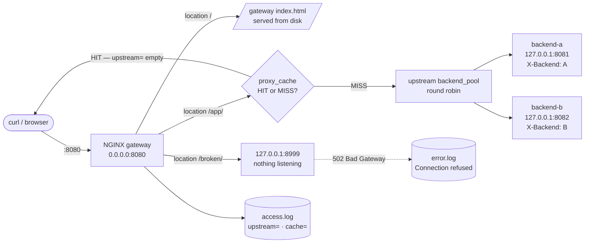

# Build an NGINX Traffic Gateway


> One NGINX process playing three roles at once — public gateway, and two upstream backends — so that round-robin balancing, a deliberate 502, and a cache MISS→HIT transition are all **observable in a single access log**, with no containers, no root, and no ports below 1024.

## 🎯 The Problem

A reverse proxy is the piece of infrastructure most people configure by copying a snippet and never actually watching work. That leaves four things unlearned:

1. **You can't tell balancing from caching.** Once a response is cached, `upstream=` goes empty — so the alternating backends *stop* alternating. Without a log that shows both fields, that reads like a broken load balancer instead of a working cache.
2. **`Cache-Control` silently wins.** A backend that sends `no-store` makes NGINX refuse to cache at all. You get `cache=MISS` forever and no error anywhere explaining why.
3. **A 502 tells you nothing on its own.** The browser shows the same white page whether the upstream is down, unreachable, or was never listening — the distinction only exists in the error log.
4. **Labs that need root or Docker don't get repeated.** Anything requiring `sudo`, port 80, or a container runtime is a lab you run once.

This build closes all four: a single prefix-relative config that runs unprivileged, a log format that prints `upstream=` and `cache=` on every line, and a controlled failure injected on purpose so the error log can be read against a known cause.

## 🏗️ Architecture



*A request arrives at the gateway on `0.0.0.0:8080`. A request for `/` is served straight off disk from the gateway's own document root. A request for `/app/` is handed to `proxy_pass`, which first consults the cache keyed on the request: on a HIT the response is returned immediately and no backend is touched at all, which is why `upstream=` logs empty. On a MISS the request goes to the `backend_pool` upstream, where round-robin alternates between backend-a on `127.0.0.1:8081` and backend-b on `127.0.0.1:8082` — sibling `server` blocks in the very same config, each stamping its own `X-Backend` header. Because both backends answer with `Cache-Control: no-store`, nothing was cacheable until `proxy_ignore_headers Cache-Control` was set on the `/app/` location. Every outcome lands in one access log with `upstream=` and `cache=` fields, so balancing and caching can be told apart at a glance — and a second path pointed at port 8999, where nothing listens, drives the deliberate 502 into the error log.*



**Flow:** the same process is the proxy and both of its own upstreams, so the entire topology is one file read top to bottom — and because the log format carries `upstream=` and `cache=` side by side, the moment caching takes over from balancing is visible on the line where it happens.

## 🔧 Implementation Highlights

- **Prefix-relative configuration (`nginx -p "$PWD" -c conf/nginx.conf`)** — every path in the config resolves against the NGINX prefix rather than a compiled-in `/etc/nginx`, which is what makes the lab portable: clone it anywhere and the same commands work, with no `sudo` and no edits to a system config.
- **Backends as sibling `server` blocks, not separate machines** — in production these would be distinct hosts, but collapsing them into one config trades realism for legibility. The entire request path, both ends of it, is auditable in a single file.
- **A custom log format carrying `upstream=` and `$upstream_cache_status`** — the single most valuable decision in the build. Stock NGINX logs show neither, which is precisely why the interaction between balancing and caching is normally invisible.
- **`proxy_ignore_headers Cache-Control` scoped to the `/app/` location** — the backends send `no-store`, which NGINX honours by refusing to store anything. Overriding it *only* on the proxied location keeps the gateway's own responses honest while letting the cache actually be exercised.
- **A deliberately unreachable upstream on port 8999** — a 502 injected on purpose, so the error log can be read against a cause that is already known. Diagnosing a failure you built yourself is how you learn to read the log for one you didn't.
- **Unprivileged, high-numbered ports throughout (8080/8081/8082)** — no `sudo`, no `CAP_NET_BIND_SERVICE`, nothing bound below 1024, so the lab is safe to run on a working machine.
- **`nginx -t` before every start and reload** — config validation as a habit rather than a recovery step; a syntax error caught at `-t` never becomes a failed reload on a running listener.

## 📊 Results & KPIs

| Metric | Outcome |
|---|---|
| Roles served by one process | **3** — gateway (`:8080`), backend-a (`:8081`), backend-b (`:8082`) |
| Load-balancing distribution | **Even alternation** — 8081/8082 strictly interleaved across consecutive `/app/` requests under NGINX's default equal weighting |
| Cache behaviour proven end to end | **MISS → HIT transition captured in the access log**, with `upstream=` going empty exactly at the first HIT |
| `Cache-Control: no-store` obstacle | **Diagnosed and overridden** — `cache=MISS` on every request until `proxy_ignore_headers` was scoped to `/app/` |
| Failure diagnosed from logs | **502 Bad Gateway** traced to nothing listening on `:8999`, distinguished from a gateway-level fault |
| Privilege required | **None** — no root, no ports below 1024, no container runtime |
| NGINX version under test | **nginx/1.31.5** |
| Build time | **~50 minutes**, reverse-proxy configuration the longest stretch |

## 📸 Proof

| Round-robin *and* caching in one log | Gateway serving its own page on :8080 |
|---|---|
|  |  |

| The deliberate 502 at the gateway | The upstream that was never listening |
|---|---|
|  |  |

More screenshots in [`Screenshots/`](Screenshots).

### 🐛 What actually broke

- **`cache=MISS` on every single request, forever.** The upstream backends answer with `Cache-Control: no-store`, and NGINX honours that by refusing to store the response at all — so the cache was configured correctly and doing nothing, with no warning in either log. Fixed with `proxy_ignore_headers Cache-Control` scoped to the `/app/` location, at which point HITs appeared immediately.
- **Load balancing "stopped working" the moment caching started working.** Once responses were being served from cache, `upstream=` logged empty and the 8081/8082 alternation vanished. That reads exactly like a broken upstream pool, but it is the cache doing its job — a HIT never touches a backend, so there is no upstream to log. Recognising this as expected behaviour rather than a regression was the real lesson of the build.
- **A 502 that had nothing to do with the gateway.** Pointing a second path at `127.0.0.1:8999` returned 502 in the browser while the gateway itself was perfectly healthy on `:8080`. The error log carried the actual cause — connection refused, because no `listen 8999` directive existed anywhere in the config. The browser tells you *that* it failed; only the error log tells you *where*.

## 💻 Source Code

The complete lab — `nginx.conf`, both backend document roots, the cache and log directories, and the run/reload instructions — lives at **[kingswanzy2020/nginx-http-lab](https://github.com/kingswanzy2020/nginx-http-lab)**.

```bash
git clone https://github.com/kingswanzy2020/nginx-http-lab.git
cd nginx-http-lab
nginx -t -p "$PWD" -c conf/nginx.conf   # validate first, always
nginx    -p "$PWD" -c conf/nginx.conf   # start
curl http://localhost:8080/             # gateway's own page
curl http://localhost:8080/app/         # proxied to the backend pool
```

## 🧰 Skills Demonstrated

`NGINX` · `Reverse proxy` · `proxy_pass` · `upstream pools` · `Round-robin load balancing` · `Upstream weighting` · `proxy_cache` · `Cache-Control semantics` · `proxy_ignore_headers` · `Custom log formats` · `$upstream_cache_status` · `Access & error log analysis` · `502 diagnosis` · `Unprivileged port binding` · `Config validation (nginx -t)` · `Graceful reload`

---

<sub>Built by **Ahmed Tetteh** ([kingsleyswanzy@gmail.com](mailto:kingsleyswanzy@gmail.com)) as part of a [NextWork](https://nextwork.ai/projects/11330ee3-5d9b-4321-a40a-761d5dd3d3a6) track, then extended — [certificate](certificate.pdf). ~1 hour of hands-on build and log-reading.</sub>
