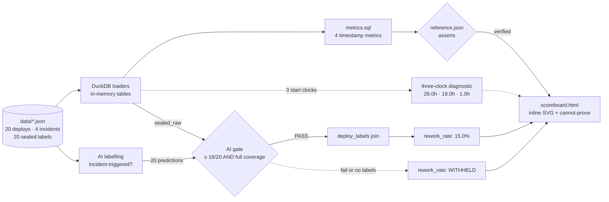

# DORA Delivery Scoreboard with DuckDB


> A DORA scoreboard that computes four delivery metrics from timestamps and **refuses to publish the fifth** until AI labels reproduce 18 of 20 hand-audited judgments — with every number shipped alongside a statement of what it cannot prove.

## 🎯 The Problem

Delivery dashboards are routinely trusted more than their data deserves. Four specific ways that happens:

1. **A number appears without its limits.** "Change fail rate: 20%" reads as a statement about quality, when all it counts is incidents someone noticed *and* attributed to a deploy.
2. **"Lead time" quietly means different things.** On the same 20 deploys it is 26.0 hours measured from commit and 1.0 hour measured from merge. Pick a clock without saying so and the metric says whatever you need it to.
3. **AI judgement gets folded in unexamined.** Rework rate needs a call — was this deploy triggered by an incident? — that no timestamp encodes. Hand that to a model and publish the answer, and a guess becomes a KPI.
4. **Metric logic hides inside loops.** Accumulators and conditionals in application code turn "what exactly does this count?" into a code-tracing exercise instead of something a reviewer can read.

This build closes all four: each metric is a named SQL block that states what it counts, excludes, and does not prove; every rendered value carries a "cannot prove" annotation; a three-clock diagnostic sits beside lead time without replacing it; and the one AI-derived metric sits behind a dual-test gate that **withholds rather than estimates**.

## 🏗️ Architecture



*A captured corpus — 20 deploys carrying four clocks each, 4 incidents, and 20 sealed labels — is loaded row by row into three in-memory DuckDB tables. `metrics.sql` is parsed into named blocks, and the four timestamp metrics execute as plain SQL: a count, two medians, and a distinct-deploy ratio. Before anything is printed, the run asserts deployment frequency, median lead time, and one deploy's exact lead time against `reference.json`, so a loader that silently drops rows fails the run instead of producing a smaller number. A three-clock diagnostic measures median time to production from commit, PR-opened, and merge, and prints on its own line — context for lead time, never a substitute for it. On the other branch, an AI pass reads each deploy's commit message and linked issue title and labels it incident-triggered or planned. The gate scores those predictions against the sealed labels and passes only on at least 18 of 20 correct and a prediction for every deploy. Only then is the `deploy_labels` join materialised and rework rate computed; on a failure, or when no label file exists, the slot prints `WITHHELD` with its reason. Everything lands in one self-contained `scoreboard.html` — inline SVG cards, each carrying its "cannot prove" line, with no scripts and no external requests.*



**Flow:** the four timestamp metrics are always reportable because they are arithmetic over recorded clocks; the fifth needs a judgement, so it is the only one behind the gate — and the only slot that can legitimately be empty.

## 🔧 Implementation Highlights

- **Metrics as SQL blocks, not Python loops (ADR-002)** — each metric is a named block in `metrics.sql` headed by `Counts`, `Excludes`, and `Does not prove` comments, so a reviewer audits a `SELECT` rather than tracing loop state. The runner takes the name from the block's first comment line, so adding a metric needs no Python change. The cost is one dependency: DuckDB.
- **Medians for both durations, distinct deploys for fail rate** — a single pathological deploy can't drag the lead-time headline, and a deploy that causes two incidents still counts as one failed deploy rather than two.
- **A dual-test AI gate: accuracy *and* coverage** — 18 of 20 on its own is gameable: a classifier that abstains on the hard cases and answers only the easy ones posts a high score while being useless exactly where it matters. Requiring `predicted_count == sealed_count` removes selective abstention as a strategy. Both edges are pinned by tests — 18 correct passes, 17 fails, and 19 perfect answers out of 20 deploys still fails on coverage.
- **Withheld beats estimated** — a failed or missing gate produces `WITHHELD` plus a reason naming the score achieved and the bar missed. There is no fallback value, no partial figure, and no number wearing a confidence qualifier.
- **"Cannot prove" as a first-class field** — each slot ships with a specific limitation (*"that a deploy reached users — it records a pipeline event, not an activated feature"*) rendered on the card itself, not in a footnote or tooltip.
- **A three-clock diagnostic kept out of the slots** — median time to production from commit, PR-opened, and merge prints as a separate line, showing where the wait sits without letting the most flattering clock stand in for DORA's commit-to-production definition.
- **Reference assertions straight after load** — deployment frequency, median lead time, and d-001's exact 27.0-hour lead time are asserted against `reference.json`, so a loader bug fails loudly instead of shipping a quietly smaller number.
- **Hand-written inline SVG, zero rendering dependencies (ADR-003)** — full control over the withheld state's red accent and annotation placement, and one HTML file that survives being emailed. The ADR records its own reversal trigger: past ten cards, move to a plotting library.
- **A captured corpus instead of a live API (ADR-001)** — runs are deterministic and offline. The ADR is explicit about the price: authentication, pagination, and rate limiting are never exercised.

## 📊 Results & KPIs

| Metric | Outcome |
|---|---|
| Deployment frequency | **20** deploys in a 30-day window |
| Change lead time (commit → production) | **26.0h** median |
| Change fail rate | **20.0%** — 4 of 20 deploys caused an incident |
| Failed deployment recovery time | **2.0h** median, impairment → restored |
| Rework rate | **WITHHELD** with no labels → **15.0%** once the gate passed (d-006, d-011, d-015 of 20) |
| AI gate score | **20 / 20** sealed labels reproduced with full coverage, against an 18/20 bar |
| Three-clock diagnostic | **26.0h → 18.0h → 1.0h** from commit / PR-opened / merge — the wait sits before merge, not in the deploy pipeline |
| Dependencies | **1** runtime dependency (DuckDB); the rendered page makes **0** network requests |
| Test suite | **31** stdlib `unittest` tests — **24 pass** at the published commit (see *What actually broke*) |
| Build time | **~1 hour** of hands-on build |

## 📸 Proof

| Four slots reported, rework rate withheld | Gate passed — rework rate released at 15.0% |
|---|---|
|  |  |

| The rendered readout — a "cannot prove" line on every card | The corpus: 20 deploys, 4 incidents, 3 incident-triggered |
|---|---|
|  |  |

More screenshots in [`Screenshots/`](Screenshots).

### 🐛 What actually broke

- **The gate held the metric because the inspector never arrived.** The first full run printed `rework_rate: WITHHELD (no AI labels found)`. That is the gate doing its job: with no `ai_labels.json` there is nothing to score against the sealed set, so the slot is held rather than guessed. Once the AI labels were committed, the gate scored 20/20 with full coverage and released 15.0%.
- **The numbers passed their audit; the caveats didn't.** A SQL recount confirmed all five values, but reviewing `scoreboard.html` against its content requirements found three gaps: the DORA anchor doesn't name report supersession or the retired performance tiers, the honest limits skip the untested data transport and the volatility of a 30-day window, and there is no "what this does not fix" section on the page. For a readout whose whole point is its caveats, correct numbers with incomplete limits is still a defect — logged as the next iteration.
- **The tests drifted behind the last two commits — 24 of 31 pass.** `SqlParserTest` still expects four SQL blocks after `rework_rate` became the fifth, and that block queries `deploy_labels`, which only exists once the gate has passed. `StdoutContractTest` asserts `ai_labels.json` is absent so it can pin the exact withheld line — but committing the labels is what released the metric. With the file moved aside the suite reaches 29 of 31. The test encodes an intent (the default run demonstrates withholding) that the committed corpus no longer matches.
- **Git alone can't feed this scoreboard.** Auditing the project's own history (`docs/finding-real-repo.md`): git proves commit timestamps and authorship, but not when PRs opened or merged, when anything reached production, which incidents occurred, or which deploy caused which. A production version needs a CI/CD platform for deploy times, a code-review API for PR clocks, incident tooling for detection and recovery, and post-incident reviews for the causal links — the hardest of the four to automate with confidence.

## 💻 Source Code

The code behind this write-up — `scoreboard.py` (loaders, gate, and inline-SVG renderer), the five named blocks in `metrics.sql`, the captured corpus and sealed labels under `data/`, the 31-test `unittest` suite, and four ADRs that each record a reversal trigger — lives at
**[kingswanzy2020/delivery-scoreboard](https://github.com/kingswanzy2020/delivery-scoreboard)**.

```bash
git clone https://github.com/kingswanzy2020/delivery-scoreboard.git
cd delivery-scoreboard
python3 -m venv .venv && source .venv/bin/activate
pip install -r requirements.txt
python scoreboard.py        # prints the five slots, writes scoreboard.html
```

## 🧰 Skills Demonstrated

`DORA metrics` · `DuckDB` · `SQL metric definitions` · `Medians over means` · `Python` · `AI output validation` · `Accuracy + coverage gating` · `Ground-truth labelling` · `Architecture Decision Records` · `Reversal triggers` · `Inline SVG rendering` · `Self-contained HTML reports` · `Boundary testing with unittest` · `Data provenance & scope limitations`

---

<sub>Built by **Ahmed Tetteh** ([kingsleyswanzy@gmail.com](mailto:kingsleyswanzy@gmail.com)) as part of a [NextWork](https://nextwork.ai/projects/f830ef72-575b-48d3-826a-8c99f0333e00) track, then extended — [certificate](certificate.pdf). ~1 hour of hands-on build.</sub>
