# Real-Time Grafana Dashboards Built Through MCP

> A live e-commerce analytics dashboard — 6 panels over PostgreSQL — built and updated **through natural language**, with an AI agent driving Grafana's API via the Model Context Protocol instead of hand-written queries and panel config.

## 🎯 The Problem

Building monitoring dashboards is high-friction: log into Grafana, wire the data source, hand-write SQL per panel, fiddle with visualization settings. That friction means dashboards don't get built or maintained. Separately, dashboards that query raw tables directly get slower as data grows.

## 🏗️ Architecture

*A natural-language prompt in Cursor — "build me a revenue dashboard" — flows through the Grafana MCP server (stdio transport, service-account token) into Grafana API calls that assemble a 6-panel dashboard of KPIs, bars, and trends. The panels query live PostgreSQL e-commerce data, where pre-aggregated materialized tables keep every refresh instant.*

## 🔧 What I Built

- **A Grafana MCP server in Cursor** (`mcp.json`: stdio transport, Grafana URL, service-account token) giving the AI agent authenticated hands on Grafana's API — dashboards created by describing them, not clicking.
- **A PostgreSQL data source** (`host.docker.internal:5432`, `demo` database) connected and verified so Grafana pulls live e-commerce data.
- **A 6-panel dashboard from natural language** — KPI stat tiles (total revenue, order count, average order value, customer count) plus bar charts of orders by status and revenue by region, and a time-series revenue trend.
- **A dbt-style performance comparison** — panels backed by pre-aggregated (materialized) tables answered instantly while the raw-table panel re-scanned every customer row per refresh; then live-updated the underlying data and watched the panels re-rank (Egypt overtaking Korea as top country) in real time.

## 📊 Results

| Metric | Outcome |
|---|---|
| Dashboard build effort | Minutes of natural-language instruction vs. manual per-panel SQL/config |
| Query performance | Pre-aggregated panels returned **instantly**; raw-table panel re-scanned all rows per refresh |
| Freshness | Data changes in PostgreSQL reflected in panels in near-real time |
| Total time | **~1.5 hours** including MCP server setup |

## 🧰 Skills Demonstrated

`Grafana` · `MCP servers` · `PostgreSQL` · `SQL & materialized aggregation patterns` · `Docker` · `AI-driven tooling`

---

Built by **Ahmed Tetteh** as part of a [NextWork](http://learn.nextwork.org/projects/mcp-data-engineer4) track — [certificate](legendary-mcp-data-engineer4.pdf).
